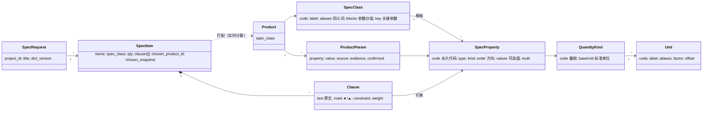

# 按技术要求匹配物料：设计方案

- 日期：2026-09-29
- 状态：设计稿，待产品负责人确认第 13 节的问题后进入实施
- 适用：询价台账（Flutter/Dart，本机 SQLite，无服务器，设备间文件或局域网交换）

---

## 0 一页读懂

**要做什么。**导入一份技术要求（例如 `docs/test-doc/设备具体选型品牌型号.xlsx` 里"主要指标要求"那一列），软件逐条理解要求，在本机物料库里找出满足要求的设备，给出"满足 / 不满足 / 待确认"和偏离情况，最后输出国内招采熟悉的**技术偏离表**。

**为什么现在做不了。**物料目前只有一个自由填写的"关键属性"表（`attributes`，键和值都是文字，最多 12 项），没有类型、单位和比较规则，软件无法判断"8 核 ≥ 八核及以上"或"IP66 满足不低于 IP65"。

**核心设计（五个决定）：**

1. **参数字典分三层**，借鉴 IEC 61360 / ECLASS / ETIM：量纲与单位 → 参数定义（稳定代码、类型、单位、比较方向、可选值）→ 类别模板（每类设备有哪些参数、哪些是关键参数）。首批模板随软件内置，团队可以在此基础上自定义扩展。
2. **参数值借鉴 ETIM 的四种类型（枚举 A / 布尔 L / 数值 N / 范围 R）**，再补上精度（±容差）、多选、文字，以及三种复合值：IP 防护等级、防爆标志、目录收录。复合值按标准规定的替代规则比较，例如 IPX7 并不等于满足 IPX5，IIC 可以替代 IIB。
3. **比较方向由参数决定，不由措辞决定。**"分辨率不低于 0.1℃"的意思是"分辨率 ≤ 0.1℃"，因为分辨率越小越好。"不低于、优于、及以上"统一理解为"不差于"，再按参数的方向换算成 ≥ 或 ≤。
4. **匹配采用三值逻辑，结果可解释。**每条约束的结果是满足、不满足或待确认（缺参数）。★ 条款是一票否决，▲ 和一般条款影响排序。每个结论都写明依据：要求值、物料值、来源、偏离类型。没有物料全部满足时，告诉用户"放宽哪一条就能多出几个候选"（借鉴约束型推荐系统的"诊断与放宽"）。
5. **AI 只做辅助，规则优先，人工确认。**比较词、数值、单位、IP 和防爆等规则能解析的，不交给 AI。解析不了的条款才交给 AI，并且只能使用字典里已有的参数代码；AI 必须给出原文依据，原文里找不到的一律退回人工。技术要求往往涉密，所以 AI 默认关闭，可以改用本地模型。

**分期：**参数字典与物料参数 → 匹配引擎 → 技术要求导入与偏离表 → 存量参数补全与 AI，前四期约 5 周；第 5 期"供应商逐条响应"可选，约 1～1.5 周（见第 12 节）。

---

## 1 背景、目标与非目标

### 1.1 场景

团队拿到设计院或业主的技术要求：每行一台设备，"主要指标要求"里是多行文字，例如：

> 温湿度传感器：（1）测量范围，温度 -20℃~+80℃；相对湿度 0%~+100%RH。（2）测量精度：温度优于 ±0.3℃，相对湿度优于 ±3%。（3）分辨率：温度不低于 0.1℃。（4）输出信号 4-20mA 或 RS485。（5）防护等级不低于 IP65。（6）防爆等级不低于 Ex d IIB T4 Gb。
>
> 工控机：CPU 八核及以上，主频 2.3GHz 及以上；内存 DDR4 16GB 2666MHz 及以上；独立显卡 2GB 以上，不少于 3 路高清输出；《军用关键软硬件自主可控产品目录》选取。

现在的做法是凭经验和记忆挑型号，再去翻说明书逐条核对。目标是让软件完成"候选筛选 + 逐条核对 + 出偏离表"，由人做最后确认。

### 1.2 目标

- **G1 结构化参数。**每类常用设备都有参数模板，物料参数是有类型、有单位、可比较的值。
- **G2 导入技术要求。**支持 Excel、粘贴文字和项目预算行，自动切分需求项和条款，并解析成约束。
- **G3 匹配与解释。**对每个需求项给出候选物料排序，逐条列出满足、不满足、待确认，以及正偏离和负偏离。
- **G4 熟悉的输出。**技术偏离表，按需求项或候选物料导出 Excel / PDF；每条响应都写具体值和依据。
- **G5 降低录入负担。**存量物料的参数可以从规格文本、型号、说明书文字中自动抽取，批量核对后入库。
- **G6 离线、多设备。**不依赖服务器；字典、参数值、技术要求都能随现有的数据交换同步，冲突可见、可解决。

### 1.3 非目标

- 不做在线字典服务，不内置 ECLASS 全量数据（体量大，而且使用需要许可，见 2.2）。
- 不做自动定标或自动下单；匹配只给出候选和依据，决定由人做。
- 不解析 PDF、Word 原文件的版式；这类文件请复制文字后粘贴，与现有的"智能导入"一致。
- 不处理"方案类"要求的自动判断，例如"软件采用 B/S 架构""满足软件工程规范"。这类要求保留为文字条款，由人逐条判断。

---

## 2 行业做法与借鉴

### 2.1 总览

| 来源 | 它怎么做 | 我们借鉴什么 | 落在本方案哪里 |
|---|---|---|---|
| **ETIM**（电气行业开放分类） | 产品类 EC、特征 EF、取值 EV、单位 EU；特征分四种：A 字母数字（只能从值列表选）、L 逻辑、N 数值、R 范围（闭区间 [a..b]）；数值和范围必须带单位；每个产品只属于一个类；类有同义词，方便查找。 | 参数值类型体系、"一个物料一个类别"、类别同义词、值列表不允许自由文本 | 4.1、4.4 |
| **ECLASS** | 四级分类，只有第 4 级类挂参数；参数用 IRDI 永久编号；数值类参数有唯一主单位，同量纲单位可以互换；值列表分"限定"和"建议"两种；Advanced 版有块（block）、基数、多态；**X、Y 开头的编号留给企业自定义**。 | 参数代码永久不变；按量纲组织单位；限定和建议两种值列表；"块"用来给参数分组（CPU、内存……）；自定义代码加前缀 | 4.1、4.2、5.1 |
| **IEC 61360 / ISO 13584（PLIB）** | 通用数据字典模型：类、属性、数据类型、值域、单位；属性可以带"条件"（如"在 25℃ 下"）。 | 把概念模型分成字典层与数据层；参数值可以附带条件说明 | 3、4.4 |
| **ISO 22745（开放技术字典）/ ISO 8000-110** | 字典只管概念；**识别指南**规定某类物料需要哪些属性，用于建档、衡量数据质量、发起数据请求；主数据是"属性-值"对；交换的数据要注明依据哪个版本的数据规范。 | 类别模板里的"关键参数"用来计算参数完整度；技术要求和参数值都记下字典版本，保证偏离表可以复现 | 4.1、4.5、9 |
| **SAP 分类系统**（CT04 特性、CL02 类、CL30N 按分类找对象） | 特性有 CHAR / NUM 等类型，分单值和多值；只有数值特性允许区间；按分类查找时，多个值之间是"或"关系；物料类的类型是 001。 | 参数分单值和多值；区间只用于数值；多值查询用"任一"和"全部"两种语义 | 4.1、8.2 |
| **SAP Ariba 寻源** | 预设"可接受值"才能自动评分；数值题按"起、止、理想值"自动打分；资格门槛不通过就不能继续参与；有权重和重要度；有投标比较。 | ★ 条款作为门槛（一票否决）；数值约束可以设"理想值"，用来量化正偏离；有投标比较式的符合性矩阵 | 8.3、8.4、10.3 |
| **Akeneo PIM** | 计量族（measurement family）：一个标准单位加各单位的换算运算；每个产品一个族，族上规定必填属性，据此算完整度。 | 量纲下挂标准单位加换算系数；按类别模板计算参数完整度 | 5.1、9 |
| **国家电网技术规范书** | 通用部分加专用部分；专用部分的"技术参数特性表"中，投标人要逐项填写**保证值**，不能空着，也不能只写"响应"；偏差进入偏差表；把"物料编码 + 技术 ID（固化 ID）"作为标准配置反复使用。 | 偏离表的每条响应必须是**具体值**；"标准选型方案"可以沉淀复用（类似固化 ID） | 10.4、12（远期） |
| **政府采购：技术偏离表与 ★ / ▲**（财政部令第 87 号第二十条） | ★ 为实质性条款，不能负偏离，否则投标无效；▲ 为重要参数，负偏离扣分更重；偏离分为无偏离、正偏离、负偏离；正偏离和无偏离需要有证明材料，否则可能被认定为虚假响应。 | 条款标记与默认权重；三种偏离的分类；每个参数值记录来源和依据，未确认的值不能当作"已证实" | 4.5、8.3、9 |
| **IEC 60529 / GB/T 4208（IP 代码）** | 防水等级只有 6 以内可以向下覆盖；IPX7、IPX8 **不代表**满足 IPX5、IPX6；两者都满足的产品要双标记，如 IP66/IP67。 | IP 等级按规则比较，不简单比数字大小 | 5.3 |
| **IEC 60079-0 / GB/T 3836.1（防爆标志）** | 气体组别 IIC 可以代替 IIB 和 IIA，IIB 可以代替 IIA；温度组别 T6 可以代替 T1～T5；设备保护级别 Ga 可以代替 Gb、Gc；防爆型式（d、e、ia……）本身没有高低之分。 | 防爆标志拆成结构化字段，逐项按替代规则比较 | 5.4 |
| **约束型推荐系统**（Felfernig、Jannach；FastDiag、QuickXPlain） | 按需求约束筛选商品；没有商品满足时，计算最少放宽哪些约束，并优先放宽用户认为不重要的。 | "放宽建议"。本方案里各约束彼此独立，逐条统计就能得到精确结果，不需要引入 FastDiag（8.6） | 8.6 |
| **安全可靠测评结果公告**（中国信息安全测评中心） | 按批次公布 CPU、操作系统、数据库等的等级（Ⅰ～Ⅲ），**有效期三年**；最新一批是 2026 年第 3 号。 | "目录收录"作为复合参数，记录目录名、批次、等级、有效期，而不是简单的"是否国产" | 5.5 |

### 2.2 刻意不借鉴的部分

- **ECLASS 全量数据。**约有 5 万个类、2.3 万个参数，浏览免费，但作为标准使用需要许可。我们只借鉴它的结构和命名方式；模板里可以填 ECLASS / ETIM 的参考编码（选填），但不附带它们的内容。
- **ECLASS Advanced 的多态和基数块。**对本团队的设备过重。"内存条 × 条数"这类重复结构，改用"单条容量、条数、总容量"几个参数表达。
- **完整的约束求解器和 SHACL 校验。**本方案的约束都是"单个参数对比一个值"，逐条求值就够了。以后出现跨参数约束（例如"总内存 = 单条 × 条数"），再考虑引入（8.7）。

---

## 3 概念模型



分三层：

1. **字典层**：量纲、单位、参数定义、类别模板。以内置为主，可自定义；与业务数据无关，只规定"怎么描述"。
2. **物料数据层**：物料归属哪个类别模板，以及每个参数的具体值。每个值都记录来源、依据和是否已确认。
3. **需求与匹配层**：技术要求 → 需求项 → 条款（原文加解析出的约束）。匹配结果**实时计算，不存储**。只在用户"定选"某个物料时，存一份当时的核对快照，保证日后导出的偏离表内容不变（这与报价里的 `contact_snapshot` 是同一种做法）。

---

## 4 数据结构

下面的字段写法沿用现有代码的风格：载荷是 JSON，按字段校验，由 `exactKeys` 保证不多不少，后加的字段缺省即为未设置（见 `Supplier.fromJson` 对 `rating` 的处理）。

### 4.1 内置字典（代码常量，随软件发布）

新增 `packages/supplier_core/lib/src/spec_dictionary.dart`，与 `ontology.dart` 同属"注册表"性质的代码：

```dart
/// 量纲：同一量纲内的单位可以互换（Akeneo 计量族 / ECLASS quantity）。
class QuantityKind {
  final String code;          // 'temperature'
  final String label;         // '温度'
  final String base;          // 标准单位代码 'Cel'
  final List<UnitDef> units;
}

class UnitDef {
  final String code;          // 'Cel'、'K'、'[degF]'（尽量沿用 UCUM 写法）
  final String label;         // '℃'
  final List<String> aliases; // ['°C', '摄氏度', 'C']
  final String factor;        // 相对标准单位的倍数，十进制文本，如 '1000'
  final String offset;        // 仅绝对温度等仿射单位使用，默认 '0'
}

/// 参数定义：代码永久不变（ECLASS IRDI 的做法），类型不可改。
class SpecProperty {
  final String code;          // 'cpu.cores'
  final String label;         // 'CPU 物理核数'
  final List<String> aliases; // ['核数', '核心数', '物理核']
  final ParamType type;       // 见下
  final String? kind;         // 量纲代码；num / range / tol 必填
  final String? unit;         // 默认显示单位
  final Order order;          // higher 越大越好 / lower 越小越好 / none 无方向
  final List<EnumValue> values; // enum / multi 的可选值
  final bool restrictive;     // true：只能取列表里的值（ECLASS 限定值列表）
  final String? help;         // 填写说明，如"指基础频率，不是睿频"
  final Map<String, String> refs; // 选填：{'eclass': '0173-1#02-…', 'etim': 'EF…'}
}

enum ParamType { num, range, tol, enumOne, enumMany, bool, text, ip, ex, catalog }

class EnumValue {
  final String code;          // 'RS485'
  final String label;         // 'RS-485'
  final List<String> aliases; // ['485', 'RS-485', 'EIA-485']
  final int? rank;            // 有序枚举的顺序：DDR3=3, DDR4=4, DDR5=5
}

/// 类别模板：一个物料只属于一个类别（ETIM 的做法）。
class SpecClass {
  final String code;          // 'computer.ipc'
  final String label;         // '工控机'
  final List<String> aliases; // ['工业计算机', '工业控制计算机', 'IPC']
  final String? parent;       // 'computer'，子类继承父类参数（Akeneo 的族继承）
  final List<ParamBlock> blocks; // 参数分组，借鉴 ECLASS Advanced 的"块"
  final Map<String, String> refs;
}

class ParamBlock {
  final String label;         // '处理器'
  final List<ClassParam> params;
}

class ClassParam {
  final String property;      // 'cpu.cores'
  final bool key;             // 关键参数：参与完整度计算（ISO 22745 识别指南）
}

const specDictionaryVersion = 1; // 内置字典内容的版本，每次发布递增
```

参数类型与 ETIM、ECLASS 的对应关系：

| 本方案 | 含义 | 对应 ETIM | 对应 ECLASS | 例 |
|---|---|---|---|---|
| `num` | 单个数值加单位 | N | REAL_MEASURE / INTEGER_COUNT | 核数 8；主频 2.3 GHz |
| `range` | 闭区间加单位，可以只有一端 | R | Level Type 的 min/max | 测量范围 -40～85 ℃ |
| `tol` | 对称容差 ±x，可以是绝对值，也可以按满量程 %FS 或读数 %RD | （N 的特例） | — | 精度 ±0.3 ℃；±1 %FS |
| `enumOne` | 从值列表里选一个 | A | STRING + 值列表 | 内存类型 DDR4 |
| `enumMany` | 从值列表里选多个 | A（多值） | 多值特性（SAP） | 输出信号 4-20mA、RS485 |
| `bool` | 是 / 否 | L | BOOLEAN | 独立显卡：是 |
| `text` | 自由文字，不参与自动比较 | — | STRING | 其他说明 |
| `ip` | IP 代码（复合值） | — | — | IP66/IP67 |
| `ex` | 防爆标志（复合值，可以有多个） | — | — | Ex db IIB T4 Gb |
| `catalog` | 目录收录（复合值，可以有多个） | — | — | 安全可靠测评 2026 年第 3 号 Ⅲ 级 |

### 4.2 自定义字典（同步的记录）

内置字典不可能覆盖所有设备，团队需要能够补充。新增两种实体：

- **`spec_property`**：字段与 `SpecProperty` 相同。
- **`spec_class`**：字段与 `SpecClass` 相同，其中 `blocks` 用 JSON 存。

规则：

- **自定义代码必须以 `x.` 开头**，例如 `x.pump.flow`。这样内置字典以后新增的代码不会与之冲突（借鉴 ECLASS 把 X、Y 开头的编号留给企业自用）。
- **记录 id 由代码推算**：对 `"spec_property:" + code` 做哈希，再按 UUID v4 的格式写出，可以通过现有的 `requireUuid` 校验。这样两台设备各自新建了同一个代码的参数，交换后会落到同一条记录上，按字段合并；有分歧的字段进入现有的"修改冲突"页，不会变成两条同名参数。
- **代码和类型建成后不可修改**；标签、同义词、说明、可选值都可以改。
- 自定义模板可以继承内置模板（`parent: 'sensor'`），只补充参数。

### 4.3 物料

`Product` 新增一个字段：

| 字段 | 类型 | 说明 |
|---|---|---|
| `spec_class` | 文本，可空 | 类别模板代码，如 `sensor.th`；为空表示未分类 |

保留现有的 `category`（自由文字，用于分组显示）和 `attributes`（自由关键属性）。`attributes` 在迁移时尽量转成结构化参数（见 9.4），转不了的继续保留，不丢数据。

### 4.4 物料参数值 `product_param`（新实体）

**为什么单独成记录，而不是在物料里加一个 `params` 字段：**现有的修改日志和字段级合并以**顶层字段**为单位（`store.dart` 的 `_log` 按字段逐项记录）。如果所有参数放在一个 `params` 字段里，两台设备分别修改同一物料的"核数"和"内存"，同步时会被当作同一字段的冲突，只能保留一边。单独成记录后，每个参数值各自合并，并且可以直接复用现有的冲突检测、回收站和修改历史。

| 字段 | 类型 | 说明 |
|---|---|---|
| `product_id` | UUID | 所属物料 |
| `property` | 文本 | 参数代码，如 `cpu.cores` |
| `value` | JSON | 按参数类型的取值，见下表 |
| `cond` | 文本，可空 | 条件说明（IEC 61360 的"条件"），如"25℃ 时"；只显示，不参与比较 |
| `source` | 枚举 | `manual` 手填 / `rule` 规则抽取 / `ai` AI 抽取 / `import` 导入 / `decoder` 型号解码 |
| `evidence` | 文本，可空 | 依据原文，如"说明书：精度 ±0.2℃（25℃）"，最长 500 字 |
| `attachment_id` | UUID，可空 | 依据文件，如说明书、检测报告（沿用现有附件） |
| `confirmed` | 布尔 | 人工确认过。未确认的值参与匹配，但结果会标明"依据未确认参数" |
| `dict_version` | 整数 | 写入时的字典版本 |

**id 由物料和参数推算**：`hash("product_param:" + product_id + ":" + property)`，写成 UUID v4 格式。同一物料的同一参数永远只有一条记录，两台设备并发补充也不会产生重复。

**`value` 的各种形状：**

```json
{"v": "8"}                                         // num，单位取参数默认单位时可省略 u
{"v": "2.3", "u": "GHz"}                           // num
{"min": "-40", "max": "85", "u": "Cel"}            // range；开区间一端写 null
{"v": "0.3", "u": "Cel"}                           // tol，绝对容差
{"v": "1", "basis": "FS"}                          // tol，满量程百分比；basis: FS | RD
{"v": "DDR4"}                                      // enumOne
{"vs": ["4-20mA", "RS485"]}                        // enumMany
{"v": true}                                        // bool
{"v": "……"}                                        // text
{"codes": ["IP66", "IP67"]}                        // ip，双标记时写两个
{"marks": [{"types": ["db"], "group": "IIB", "temp": "T4", "epl": "Gb"}]}   // ex
{"entries": [{"name": "安全可靠测评", "batch": "2026年第3号", "level": "Ⅲ",
  "valid_until": "2029-09-20"}]}                   // catalog
```

数值一律用现有的精确十进制（`ExactDecimal`）存成文本，不经过浮点。

**校验：**参数代码必须存在于字典中；值的形状必须与类型一致；单位必须属于该参数的量纲；限定值列表的枚举值必须在列表内。字典里查不到的代码（可能来自更新版本的字典），只校验"形状是合法 JSON"，界面上显示为"未知参数"，不会丢失。

### 4.5 技术要求

**`spec_request`**（一份技术要求文件）：

| 字段 | 说明 |
|---|---|
| `project_id` | 可空；通常挂在项目下 |
| `title` | 如"泵房监控系统技术要求" |
| `source_name` | 来源文件名，或"粘贴文本" |
| `attachment_ids` | 原始文件（沿用现有附件，作为依据保存） |
| `dict_version` | 解析时的字典版本（借鉴 ISO 8000-110"注明数据规范版本"） |
| `notes` | 备注 |

**`spec_item`**（一个需求项，对应表格中的一行设备）：

| 字段 | 说明 |
|---|---|
| `request_id` | 所属技术要求 |
| `seq` | 序号 |
| `name` | 设备名称原文，如"温湿度传感器" |
| `spec_class` | 识别出的类别模板，可空（待识别） |
| `qty`、`unit` | 数量和单位（原文解析，与预算行规则相同） |
| `project_item_id` | 可空；关联到哪一条预算行 |
| `clauses` | 条款列表（JSON 数组，见下） |
| `chosen_product_id` | 可空；定选的物料 |
| `chosen_snapshot` | 可空；定选时的逐条核对结果快照，用于导出和追溯 |
| `notes` | 备注 |

**条款 `Clause`**（嵌在 `spec_item.clauses` 里）：

```json
{
  "n": 3,
  "text": "分辨率：温度不低于0.1℃",
  "mark": "none",                       // star ★ | triangle ▲ | none
  "kind": "param",                      // param 可自动比较 | text 需人工判断
  "c": {"p": "th.temp_resolution", "op": "le", "v": "0.1", "u": "Cel"},
  "weight": 1,
  "by": "rule",                         // rule | ai | manual
  "evidence": "不低于0.1℃",
  "reviewed": true                      // 用户核对过解析结果
}
```

条款放在需求项里用数组保存，而不是拆成单独的记录。原因是一份技术要求通常由一个人整理，多台设备同时改同一个需求项的情况很少；即使发生，也会作为整个字段的冲突出现在"修改冲突"页里，不会悄悄丢失。

**约束 `c` 的运算符：**

| op | 含义 | 适用类型 | 例 |
|---|---|---|---|
| `ge` / `le` | ≥ / ≤ | num、tol、有序 enumOne（按 `rank`） | 核数 ≥ 8；精度 ≤ 0.3℃；内存类型不低于 DDR4 |
| `gt` / `lt` | > / <（严格） | num | 大于 2 GiB |
| `eq` | 等于 | num、enumOne、bool | 防爆型式 = d；形态 = 2U |
| `covers` | 物料范围覆盖要求范围 | range | 测量范围覆盖 [-20, 80] ℃ |
| `within` | 物料值落在要求范围内 | num、range | 工作电压在 DC 20～28V 内 |
| `any` | 物料具备其中任一 | enumMany | 输出 4-20mA 或 RS485 |
| `all` | 物料具备全部 | enumMany | 支持 Modbus TCP、OPC UA |
| `ip_ge` | IP 不低于 | ip | 不低于 IP65 |
| `ex_ge` | 防爆不低于 | ex | 不低于 Ex d IIB T4 Gb |
| `listed` | 在目录中（可以附带等级、有效期要求） | catalog | 《……目录》选取 |
| `true` | 具备 | bool | 具备二次开发功能 |

`ideal` 为可选的理想值（借鉴 Ariba 的"起、止、理想值"），用来量化正偏离的程度。

### 4.6 数据格式版本与迁移

数据格式升到**第 8 版**：

- `entityTypes` 新增 `spec_property`、`spec_class`、`product_param`、`spec_request`、`spec_item`。现有的交换、合并、回收站、数据中心、AI 工具、MCP 都遍历 `entityTypes`，会自动覆盖这些新实体。
- `Product.fields` 追加 `spec_class`。缺省时视为未设置，与第 7 版加 `rating` 的做法一致。
- 新建索引：`product_param` 的 `json_extract(data,'$.product_id')`，以及 `(json_extract(data,'$.property'), json_extract(data,'$.product_id'))`，供匹配时按参数批量读取。
- `ontology.dart` 登记新实体和字段说明；`validatorEnums` 登记新的枚举。
- 迁移：`migrate()` 自动补全空字段。另外单独提供一个"关键属性转结构化参数"的工具（9.4），**不在启动时自动执行**，因为转换需要人确认。
- 旧版设备会拒绝第 8 版的交换文件并提示升级，与之前几次升级规则相同。

### 4.7 同步与冲突一览

| 对象 | 同步方式 | 并发时 |
|---|---|---|
| 内置字典 | 随软件版本发布，不走交换 | 由版本号区分；字典版本较新的设备写入的新代码，在旧设备上显示为"未知参数"，不丢数据 |
| 自定义参数、模板 | 普通记录，id 由代码推算 | 同一代码自动合为一条，逐字段合并；分歧进入冲突页 |
| 物料的 `spec_class` | 物料的一个字段 | 字段级合并 |
| 参数值 | 每个参数一条记录，id 由物料和参数推算 | 不同参数互不影响；同一参数两边都改了，进入冲突页 |
| 技术要求、需求项 | 普通记录；条款以数组整体合并 | 条款整体冲突，进入冲突页 |
| 定选快照 | 需求项的字段 | 字段级合并 |

---

## 5 单位、量纲与复合值

### 5.1 量纲与单位（首批）

| 量纲 | 标准单位 | 可换算单位 | 注意 |
|---|---|---|---|
| 温度 | ℃ | K、℉ | **绝对温度与温差不同**：℃ 与 K 之间有偏移，但 ±0.3℃ 的精度是温差，换成 K 数值不变，换成 ℉ 乘以 9/5。精度、分辨率类参数使用"温差"量纲。 |
| 相对湿度 | %RH | — | 与普通百分比不能互换 |
| 频率 | Hz | kHz、MHz、GHz | |
| 存储容量（内存） | GiB | MiB、TiB | 内存按 1024 进位，界面上仍然显示为"GB"；与硬盘分开，避免混用 |
| 存储容量（磁盘） | GB | TB、MB | 按 1000 进位 |
| 数据速率 | bit/s | kbit/s、Mbit/s、Gbit/s | "千兆"对应 1 Gbit/s |
| 长度 | m | mm、cm、km | |
| 截面积 | mm² | — | 电缆 |
| 电压 | V | mV、kV | 交流、直流是参数属性，不是单位 |
| 电流 | A | mA | 4-20mA 是信号类型（枚举），不是电流量 |
| 功率 | W | kW | |
| 时间 | s | ms、min、h | 响应时间"≤30 秒" |
| 声压级 | dB(A) | — | |
| 气体浓度（体积比） | ppm | ppb、%VOL（1 %VOL = 10000 ppm） | **%LEL 与 ppm 不能直接换算**，需要知道气体的爆炸下限；**mg/m³ 与 ppm 也不能直接换算**，需要分子量和温度、压力。遇到这两种情况，结果记为"待确认"，不做猜测。 |
| 显示尺寸 | 英寸 | — | |
| 计数 | 个 | 核、线程、路、条、口 | 数量类参数不带单位（ETIM 的规则） |

单位别名放在字典里，例如"℃ / °C / 摄氏度""GHz / G赫兹""Mbps / Mbit/s / M"。

换算用精确十进制：乘以系数、加上偏移，结果保留 6 位小数；比较时容许末位 1 个单位的误差，避免 ℉ 换算的循环小数造成误判。

### 5.2 精度（`tol`）的比较

- 精度越小越好（`order: lower`）。"优于 ±0.3℃"表示 ≤ 0.3℃。
- 绝对值、满量程百分比（%FS）、读数百分比（%RD）三种写法，只有写法相同时才直接比较。%FS 可以借助物料的量程换算成绝对值：±1 %FS，量程 0～100 ppm，换算为 ±1 ppm。能换算的就换算，并在说明里写明；换算不了的记为"待确认"。

### 5.3 IP 防护等级

IP 代码拆成两部分：防尘数字（0～6）和防水数字（0～9，含 9K）。物料可以有多个代码，例如双标记 IP66/IP67。

"不低于 IPab"的判定：

1. 物料任一代码的防尘数字 ≥ a（X 表示未测试，按不满足处理）；
2. 防水数字：
   - 要求的 b ≤ 6：物料有某个防水数字在 b～6 之间，即满足（6 以内可以向下覆盖）。物料只有 7 或 8 时**不满足**，因为 IEC 60529 规定只标 7、8 的外壳不适用于喷水。
   - 要求的 b 为 7 或 8：物料必须有 7 或 8，且不低于 b（8 可以覆盖 7）。
   - 要求 9 或 9K：必须有 9 或 9K。

例：要求"不低于 IP65"。物料 IP67 → **不满足**（防水只到浸水，未证明防喷水），说明写"IP67 不代表满足 IPX5，需双标记 IP65/IP67 或提供喷水试验报告"。物料 IP66/IP67 → 满足，而且是正偏离。

### 5.4 防爆标志

结构：`{types: [防爆型式], group: 组别, temp: 温度组别, epl: 设备保护级别}`。一台设备可以有多个标志，例如同时有气体和粉尘标志，或者多种防爆型式组合；只要其中一个标志满足即可。

| 字段 | 取值 | 比较规则（依据 IEC 60079-0 / GB/T 3836.1） |
|---|---|---|
| 组别 | I（煤矿）；IIA < IIB < IIC；IIIA < IIIB < IIIC（粉尘） | 同一大类内，高的可以代替低的；I、II、III 三类之间不能互相代替 |
| 温度组别 | T1 … T6（也可以写最高表面温度，如 135℃） | 数字大的可以代替数字小的：T6 可用于要求 T4 的场合；写成温度时比较"≤" |
| 设备保护级别 | Ga > Gb > Gc；Da > Db > Dc；Ma > Mb | 高的可以代替低的 |
| 防爆型式 | d、db、e、eb、ia、ib、ic、p、m、n、t 等 | **没有高低之分**。默认要求型式一致；旧写法"Ex d"与新写法"Ex db"视为相同。如果要求原文写"或同等"，改为只比较组别、温度和级别 |

例：要求"不低于 Ex d IIB T4 Gb"。物料"Ex db IIC T6 Gb"满足，组别和温度两项都是正偏离。物料"Ex ia IIC T4 Ga"：级别更高，但型式不同，结果为"待确认"，说明写"型式不同（本安 ia 与隔爆 d），是否接受由人决定"。

### 5.5 目录收录

每条收录记录包含：目录名（带同义词）、批次、等级、有效期。

约束 `listed` 可以要求：

- 目录名匹配；
- 等级不低于某级（可选）；
- 在某日（默认今天）仍在有效期内。

注意：**不同目录不能互相替代。**样例里的《军用关键软硬件自主可控产品目录》与"安全可靠测评结果"是两份不同的清单。物料只有后者时，结果是"待确认"，而不是"满足"。

### 5.6 接口、协议与有序枚举

- 接口和协议用多选枚举，靠同义词归一，例如 RS485 / RS-485 / 485。容易混淆的要分成不同值：Modbus RTU 与 Modbus TCP；OPC DA 与 OPC UA。
- 有序枚举（DDR3 < DDR4 < DDR5；显示分辨率等级）用 `rank` 比较高低。但"更高一代"不一定兼容，所以有序枚举的正偏离一律标注"代际不同，需确认兼容"，不自动算作无偏离。
- 含义不明确的词在字典里写明团队约定，并在核对界面上提示。例如"2K"在国内有时指 1920×1080，有时指 2560×1440，见第 13 节待决问题 5。

---

## 6 参数模板库（首批）

符号：方向 ↑ 越大越好，↓ 越小越好，= 须一致，— 无方向；"关键"表示参与完整度计算。表中只列具有代表性的参数；同义词、说明、参考编码在实现时补全。

### 6.1 通用参数（多个类别共用）

| 代码 | 名称 | 类型 | 单位 | 方向 | 说明 |
|---|---|---|---|---|---|
| `gen.brand_origin` | 品牌属地 | enumOne | — | = | 国产 / 合资 / 进口；对应"要求国产品牌" |
| `env.op_temp` | 工作温度 | range | ℃ | covers | |
| `env.op_rh` | 工作湿度 | range | %RH | covers | 可附"无冷凝" |
| `prot.ip` | 防护等级 | ip | — | ip_ge | |
| `prot.ex` | 防爆标志 | ex | — | ex_ge | |
| `comp.catalog` | 目录收录 | catalog | — | listed | 自主可控、安全可靠、节能等目录 |
| `pwr.supply` | 供电 | enumMany | — | any | AC220V、DC24V、PoE… |
| `gen.industrial` | 工业级、7×24 小时连续运行 | bool | — | true | |

### 6.2 服务器 / 工控机 / 计算机（`computer`，子类 `computer.server`、`computer.ipc`、`computer.pc`）

| 块 | 代码 | 名称 | 类型 | 单位 | 方向 | 关键 | 说明 |
|---|---|---|---|---|---|---|---|
| 处理器 | `cpu.arch` | 指令集架构 | enumOne | — | = | ✓ | x86-64 / ARM64 / LoongArch / SW64 / MIPS |
| | `cpu.vendor` | 处理器厂商 | enumOne | — | = | | 海光、兆芯、鲲鹏、飞腾、龙芯、申威、Intel、AMD… |
| | `cpu.model` | 处理器型号 | text | — | — | | |
| | `cpu.sockets` | 路数 | num | 个 | ↑ | | |
| | `cpu.cores` | 物理核数（每颗） | num | 核 | ↑ | ✓ | "八核"即 8 |
| | `cpu.threads` | 线程数（每颗） | num | 线程 | ↑ | | |
| | `cpu.base_freq` | 基础主频 | num | GHz | ↑ | ✓ | 要求里只写"主频"时，默认指基础主频，并在核对时提示 |
| | `cpu.boost_freq` | 最高睿频 | num | GHz | ↑ | | |
| 内存 | `mem.type` | 内存类型 | enumOne | — | ↑（有序） | ✓ | DDR3 / DDR4 / DDR5，代际不同需确认 |
| | `mem.speed` | 内存频率 | num | MT/s | ↑ | | 习惯写成"2666MHz"，按同一数值处理 |
| | `mem.total` | 配置总容量 | num | GiB | ↑ | ✓ | |
| | `mem.dimm_size` | 单条容量 | num | GiB | ↑ | | |
| | `mem.dimm_count` | 条数 | num | 条 | ↑ | | |
| | `mem.max` | 最大支持容量 | num | GiB | ↑ | | |
| | `mem.slots` | 内存插槽数 | num | 个 | ↑ | | |
| 存储 | `disk.total` | 硬盘总容量 | num | GB | ↑ | | |
| | `disk.type` | 硬盘类型 | enumMany | — | any | | SSD / HDD / NVMe |
| | `disk.bays` | 硬盘位 | num | 个 | ↑ | | |
| | `disk.raid` | RAID 级别 | enumMany | — | all | | 0 / 1 / 5 / 6 / 10 |
| 图形与显示 | `gpu.discrete` | 独立显卡 | bool | — | true | | |
| | `gpu.mem` | 显存 | num | GiB | ↑ | | |
| | `gpu.outputs` | 显示输出路数 | num | 路 | ↑ | | "不少于 3 路高清输出" |
| | `gpu.ports` | 显示接口 | enumMany | — | all | | HDMI / DP / VGA / DVI |
| 网络 | `nic.ports` | 网口数 | num | 口 | ↑ | | |
| | `nic.speed` | 网口速率 | num | Gbit/s | ↑ | | |
| 电源与结构 | `psu.redundant` | 冗余电源 | bool | — | true | | |
| | `form.factor` | 形态 | enumOne | — | = | | 塔式 / 1U / 2U / 4U / 壁挂 / 嵌入式 |
| 软件与合规 | `os.name` | 预装操作系统 | enumOne | — | = | | 麒麟 / 统信 / Windows / … |
| | `sw.licensed` | 正版授权 | bool | — | true | | |
| | `comp.catalog` | 目录收录 | catalog | — | listed | | |

### 6.3 显示器（`display.monitor`）

| 代码 | 名称 | 类型 | 单位 | 方向 | 关键 | 说明 |
|---|---|---|---|---|---|---|
| `disp.size` | 尺寸 | num | 英寸 | ↑ | ✓ | |
| `disp.aspect` | 长宽比 | enumOne | — | = | | 16:9 / 16:10 / 21:9 |
| `disp.res` | 分辨率 | enumOne（有序） | — | ↑ | ✓ | FHD 1920×1080 / QHD 2560×1440 / 4K 3840×2160；"2K"的含义需团队约定 |
| `disp.refresh` | 刷新率 | num | Hz | ↑ | | |
| `disp.response` | 响应时间 | num | ms | ↓ | | |
| `disp.ports` | 接口 | enumMany | — | all | | HDMI / DP / VGA / USB-C |
| `disp.psu_internal` | 内置电源 | bool | — | true | | |

### 6.4 温湿度传感器 / 变送器（`sensor.th`）

| 代码 | 名称 | 类型 | 单位 | 方向 | 关键 | 说明 |
|---|---|---|---|---|---|---|
| `th.temp_range` | 温度测量范围 | range | ℃ | covers | ✓ | |
| `th.rh_range` | 湿度测量范围 | range | %RH | covers | ✓ | |
| `th.temp_accuracy` | 温度精度 | tol | ℃（温差） | ↓ | ✓ | |
| `th.rh_accuracy` | 湿度精度 | tol | %RH | ↓ | ✓ | |
| `th.temp_resolution` | 温度分辨率 | num | ℃（温差） | ↓ | | "不低于 0.1℃"即 ≤ 0.1 |
| `th.rh_resolution` | 湿度分辨率 | num | %RH | ↓ | | |
| `io.output` | 输出信号 / 通信接口 | enumMany | — | any | ✓ | 4-20mA / 0-10V / RS485 / 以太网 / 无线 |
| `io.protocol` | 通信协议 | enumMany | — | all | | Modbus RTU / Modbus TCP / MQTT |
| `prot.ip`、`prot.ex`、`env.op_temp`、`pwr.supply` | | | | | | 通用参数 |

### 6.5 气体检测探头（`sensor.gas`，子类有毒、可燃、氧气）

参考：ETIM 有类 EC010378"Portable gas detector"（便携式气体检测仪）。本团队多为固定式探头，只作近似参考。

| 代码 | 名称 | 类型 | 单位 | 方向 | 关键 | 说明 |
|---|---|---|---|---|---|---|
| `gas.target` | 检测气体 | enumMany | — | all | ✓ | O₂、CO、H₂S、CH₄、偏二甲肼、四氧化二氮…（值列表可扩展） |
| `gas.principle` | 检测原理 | enumOne | — | = | | 电化学 / 催化燃烧 / 红外 / PID |
| `gas.range` | 量程 | range | ppm、%VOL、%LEL | covers | ✓ | 不同写法的换算见 5.1 |
| `gas.resolution` | 分辨率 | num | 同量程 | ↓ | | |
| `gas.accuracy` | 精度 | tol | 绝对或 %FS | ↓ | ✓ | |
| `gas.t90` | 响应时间（T90） | num | s | ↓ | ✓ | "响应时间 ≤ 30 秒" |
| `gas.recovery` | 恢复时间 | num | s | ↓ | | |
| `io.output`、`io.protocol` | | | | | | 同 6.4 |
| `prot.ex` | 防爆标志 | ex | — | ex_ge | ✓ | |
| `prot.ip`、`env.op_temp`、`env.op_rh` | | | | | | 通用参数 |

### 6.6 数据采集器 / 网关 / 协议转换（`comm.gateway`）

| 代码 | 名称 | 类型 | 单位 | 方向 | 关键 | 说明 |
|---|---|---|---|---|---|---|
| `gw.south_ports` | 下行接口 | enumMany | — | all | ✓ | RS485 / RS232 / CAN / PROFIBUS-DP / 以太网 |
| `gw.north_ports` | 上行接口 | enumMany | — | all | | 以太网 / 4G / 光口 |
| `gw.protocols` | 支持协议 | enumMany | — | all | ✓ | Modbus TCP、Modbus RTU、OPC DA、OPC UA、Siemens S7、MQTT、HTTP/HTTPS… |
| `gw.channels` | 采集点数或通道数 | num | 路 | ↑ | | "至少 23 路" |
| `gw.baud` | 串口速率范围 | range | bit/s | covers | | "9.6k～1.5Mbps" |
| `gen.industrial`、`gen.brand_origin`、`env.op_temp` | | | | | | 通用参数 |

### 6.7 PLC 控制系统（`control.plc`）

| 代码 | 名称 | 类型 | 单位 | 方向 | 关键 | 说明 |
|---|---|---|---|---|---|---|
| `plc.di`、`plc.do`、`plc.ai`、`plc.ao` | 各类 I/O 点数 | num | 点 | ↑ | ✓ | "余量 20%"作为文字条款，或换算成具体点数后比较 |
| `plc.chips_domestic` | 主要芯片国产 | bool | — | true | | |
| `plc.protocols` | 通信协议 | enumMany | — | all | | |
| `gen.brand_origin`、`comp.catalog` | | | | | | 通用参数 |

### 6.8 声光报警器（`alarm.av`）

| 代码 | 名称 | 类型 | 单位 | 方向 | 关键 | 说明 |
|---|---|---|---|---|---|---|
| `alarm.spl` | 声级 | num | dB(A) | ↑ | ✓ | "不小于 90dB" |
| `alarm.light` | 光源 | enumOne | — | = | | LED / 氙灯 |
| `alarm.flash` | 发光方式 | enumOne | — | = | | 频闪 / 常亮 / 旋转 |
| `alarm.voice` | 语音播报 | bool | — | true | | |
| `alarm.programmable` | 支持二次开发 | bool | — | true | | |
| `env.op_temp`、`env.op_rh`、`prot.ex`、`prot.ip` | | | | | | 通用参数 |

### 6.9 电缆（`cable.control`、`cable.power`）

| 代码 | 名称 | 类型 | 单位 | 方向 | 关键 | 说明 |
|---|---|---|---|---|---|---|
| `cable.use` | 用途 | enumOne | — | = | ✓ | 控制 / 电力 / 信号 / 通信 |
| `cable.cores` | 芯数 | num | 芯 | = | ✓ | |
| `cable.csa` | 截面 | num | mm² | ↑ | ✓ | |
| `cable.conductor` | 导体 | enumOne | — | = | | 铜 / 铝；软导体 R |
| `cable.insulation`、`cable.sheath` | 绝缘、护套 | enumOne | — | = | | V 聚氯乙烯、YJ 交联聚乙烯… |
| `cable.shield` | 屏蔽 | enumOne | — | = | | 无 / P 铜丝编织 / P2 铜带 / P3 铝塑复合 |
| `cable.flame` | 阻燃 / 耐火等级 | enumOne（有序） | — | ↑ | ✓ | ZR（旧写法）、ZA、ZB、ZC（GB/T 19666）、耐火 N |

电缆型号可以按规则解码，例如"ZR-KVVP-4×1.5"解出：阻燃、控制电缆、铜芯、聚氯乙烯绝缘、聚氯乙烯护套、编织屏蔽、4 芯、1.5 mm²（见 9.2）。

### 6.10 软件开发服务（`service.software`）

这类要求几乎都是方案和功能描述，**不适合参数化匹配**。模板只提供少数可比较的参数，例如"含第三方测评（bool）""架构 B/S、C/S（enumOne）"；其余全部作为文字条款，由人判断。这样做是为了不让软件在这类需求上给出看似精确的错误结论。

---

## 7 技术要求导入与解析

### 7.1 输入

1. **Excel 文件**：复用 `sheet_offers.dart` 的表头识别和合并单元格续行逻辑。表头加入"主要指标要求 / 技术参数 / 技术要求 / 规格要求"列（映射为 `requirements`）和"数量 / 单位"列。每一行设备生成一个需求项。
2. **粘贴文字**：从 Word 或 PDF 复制。带制表符的表格复用现有的 `tableFromText`；纯文字按"设备名称 + 要求"的段落切分。
3. **项目预算行**：对项目里"待询价"的物料行直接生成需求项，行名作为设备名称，备注里的"要求：…"作为要求文字。现有的"按清单建项目"已经把要求写进备注。

### 7.2 流程

```
读入 → 切分需求项 → 识别类别 → 切分条款 → 规则解析 →（可选）AI 解析 → 校验 → 人工核对 → 保存
```

- **识别类别**：用设备名称匹配类别模板的名称和同义词（ETIM 的同义词做法），再参考本机同名物料已归的类别；识别不出的交给 AI（可选），最后由人确认。
- **切分条款**：按换行、"；"、编号（"（1）""1）""①"）切分。"具体传感器主要技术指标："这类不含要求的标题行，保留为上下文，不算条款。条款开头的 ★、▲、※ 等标记识别为 `mark`。

### 7.3 规则解析（默认，离线可用）

**第一步，识别参数。**在该类别模板的参数范围内，按名称和同义词匹配，例如"测量范围 / 量程"→ 范围类参数，"精度 / 测量精度"→ 精度。一个条款可以包含多个参数，例如"CPU：八核及以上，主频 2.3GHz 及以上"，按参数名称拆成多个约束。

**第二步，识别比较词**（附录 A 为完整词表）：

| 措辞 | 含义 |
|---|---|
| ≥、不小于、大于等于、不少于、至少、以上、及以上 | 数值 ≥ |
| ≤、不大于、小于等于、不超过、不高于、以内、以下、及以下 | 数值 ≤ |
| **不低于、优于、不劣于、不差于** | **"不差于"：按参数方向换算**。↑ 参数为 ≥，↓ 参数为 ≤ |
| a～b、a-b、a 至 b、从 a 到 b | 范围（范围类参数用 covers，数值类参数用 within） |
| A 或 B | any |
| A、B 和 C；支持 A、B | all |
| 具备、支持、带、有（后接功能） | true |
| 为、采用、= | eq |

"不低于"不能一律按 ≥ 处理。样例中"分辨率：温度不低于 0.1℃"如果按 ≥，会把分辨率 1℃ 这种更差的物料判为满足。反过来，"不小于 0.1"按字面是 ≥，与方向相冲突时标记出来，请人核对。

**第三步，识别数值和单位。**支持负数、区间、±、全角符号、中文数字（八核、两路、三路）、"万"，以及单位和别名（附录 B）。数值保存为精确十进制。

**第四步，识别复合值。**IP 代码和防爆标志用专门的解析器，能容忍"EX d IIBT4 Gb""ExdIIBT4"这类空格和大小写不规范的写法。

解析失败或有歧义的条款，标成"需要核对"，不会悄悄丢弃。

### 7.4 AI 解析（可选）

启用条件：用户在设置中打开"技术要求使用 AI 解析"。默认**关闭**，理由见 13.1。可以填写本地模型的地址；现有的"服务地址"设置本来就兼容 OpenAI 接口格式。

**发送给 AI 的内容**只有：条款原文、该类别模板的参数清单（代码、名称、类型、单位、可选值）。不发送本机任何物料数据。

**输出格式**（JSON）：

```json
{
  "constraints": [
    {"property": "gas.t90", "op": "le", "value": "30", "unit": "s",
     "evidence": "响应时间：≤30秒"}
  ],
  "text_only": false
}
```

**约束条件：**

- `property` 只能取给定清单里的代码，`unit` 只能取该参数量纲下的单位，`op` 只能取运算符表中的值；
- `evidence` 必须是条款原文的**连续片段**；
- 没把握时返回 `text_only: true`。

**回来后本机校验：**

- 参数代码不存在、单位不属于量纲、原文里找不到 `evidence`、数值与原文数字对不上，任何一项不满足就丢弃这条约束，该条款转为文字条款。原文比对复用 `material_import.dart` 里 `unverifiedFields` 的数字比对做法。
- 通过校验的约束标记为 `by: ai`，在界面上以虚线框显示为"待核对"，与现有的智能导入一致。

### 7.5 人工核对界面

左栏是条款原文，被解析的片段高亮；右栏是解析出的约束"卡片"，写明参数、运算符、值和单位，可以直接修改。未解析的条款显示为"需人工判断的文字条款"。整份技术要求可以一键"全部确认"，也可以逐条确认。确认后 `reviewed: true`。

### 7.6 样例（取自 `docs/test-doc/设备具体选型品牌型号.xlsx`）

**需求项：温湿度传感器（类别 `sensor.th`）**

| 条款原文 | 解析结果 |
|---|---|
| （1）测量范围，温度 -20℃~+80℃；相对湿度：0%~+100%RH。 | `th.temp_range covers [-20, 80] ℃`；`th.rh_range covers [0, 100] %RH` |
| （2）测量精度要求：温度优于 ±0.3℃，相对湿度优于 ±3%。 | `th.temp_accuracy le 0.3 ℃`（精度 ↓，"优于"即 ≤）；`th.rh_accuracy le 3 %RH` |
| （3）分辨率：温度不低于 0.1℃，相对湿度不低于 0.1%。 | `th.temp_resolution le 0.1 ℃`；`th.rh_resolution le 0.1 %RH`（分辨率 ↓，"不低于"即不差于，也就是 ≤） |
| （4）输出信号 4-20mA 或 RS485 标准工业信号…… | `io.output any [4-20mA, RS485]`；"与……适配"保留为文字条款 |
| （5）防护等级不低于 IP65。 | `prot.ip ip_ge IP65` |
| （6）防爆等级不低于 EX d IIB T4 Gb。 | `prot.ex ex_ge {types: [d], group: IIB, temp: T4, epl: Gb}` |

**需求项：工控机（类别 `computer.ipc`）**

| 条款原文 | 解析结果 |
|---|---|
| CPU：八核及以上，主频 2.3GHz 及以上 | `cpu.cores ge 8`；`cpu.base_freq ge 2.3 GHz`（提示："主频"默认按基础主频） |
| 内存：DDR4 16GB 2666MHz 及以上 | `mem.type ge DDR4`（有序枚举；DDR4 为无偏离，DDR5 判为"待确认：代际不同，需确认兼容"，DDR3 为负偏离）；`mem.total ge 16 GiB`；`mem.speed ge 2666 MT/s` |
| 显卡：独立显卡，2GB 以上，不少于 3 路高清输出信号 | `gpu.discrete true`；`gpu.mem ge 2 GiB`；`gpu.outputs ge 3` |
| 《军用关键软硬件自主可控产品目录》（最新版）选取 | `comp.catalog listed {name: 军用关键软硬件自主可控产品目录}` |
| 配套正版授权操作系统，常用办公软件 | `sw.licensed true`；"常用办公软件"保留为文字条款 |

**需求项：气体浓度检测探头（毒气）（类别 `sensor.gas`）**

| 条款原文 | 解析结果 |
|---|---|
| （1）量程：0～100ppm | `gas.range covers [0, 100] ppm` |
| （3）响应时间：≤30 秒 | `gas.t90 le 30 s` |
| （6）防爆等级：不低于 ExdIIBT4 | `prot.ex ex_ge {types: [d], group: IIB, temp: T4}`（原文未写保护级别，不比较该项） |

---

## 8 匹配算法

### 8.1 候选集

- 同一类别模板（含子类）的物料，排除已删除和已合并的。
- 未分类但名称或类别文字与需求项相近的物料，作为"未分类候选"单独列出，提示"先归类、补参数才能比较"。
- 可选：只看"有有效报价"的物料，或只看某些品牌。

### 8.2 单条约束的判定

每条约束对每个物料给出一个结果和一种偏离类型：

| 结果 | 偏离类型 | 条件 |
|---|---|---|
| 满足 | **无偏离** | 恰好满足，例如 ≥8 核且物料为 8 核；范围正好相同；枚举相同 |
| 满足 | **正偏离** | 优于要求，例如 ≥8 核而物料 16 核；范围更宽；IP、防爆等级更高 |
| 不满足 | **负偏离** | 未达到要求 |
| 待确认 | — | 物料缺少这个参数；单位无法换算（如 %LEL 与 ppm）；防爆型式不同；有序枚举代际不同；目录不同 |
| 不适用 | — | 文字条款，需要人工判断；人工判断后记为满足或不满足 |

参数值未确认（`confirmed: false`）时，照常判定，但结果带上"依据未确认参数"的标记。偏离表里对应的行会提示补充依据（见 2.1：没有证明材料的正偏离，可能被认定为虚假响应）。

### 8.3 条款分级与权重

| 标记 | 默认处理 | 默认权重 |
|---|---|---|
| ★ | 硬约束：不满足即排除（一票否决） | — |
| ▲ | 软约束，比一般条款更重要 | 3 |
| 一般 | 软约束 | 1 |

用户可以逐条调整。技术要求里完全没有 ★、▲ 标记时，默认**所有参数条款都按硬约束筛选**（用户的目标是"找到满足要求的设备"），同时展示"接近满足"的候选（见 8.4）。这个默认值见第 13 节待决问题 3。

### 8.4 排序

按以下顺序逐项比较（字典序），比加权总分更容易解释：

1. ★ 条款不满足的数量，少者优先（不为 0 的归入"不满足"组，默认折叠）；
2. 不满足条款的权重和，少者优先；
3. 待确认条款的权重和，少者优先；
4. 正偏离数量，多者优先（有理想值时，按接近理想值的程度）；
5. 有有效报价的优先，价格低者优先（复用 `quoteOptions`）。

分组展示：**完全满足**（无不满足、无待确认）、**基本满足**（只有软约束不满足或有待确认）、**不满足**（有 ★ 不满足）。

每个候选显示一行摘要，例如"满足 12 / 14，待确认 2，正偏离 3"。需要打分时，可以按 Ariba 的方式换算成百分制：满足得 1，不满足得 0，待确认按 0 计但单独列出；得分 = Σ 权重 × 得分 ÷ Σ 权重。

### 8.5 解释

每个格子都能展开查看依据，例如：

> 要求：CPU 物理核数 ≥ 8（原文"八核及以上"）
> 物料：16 核（来源：说明书，已确认；附件 XX 说明书.pdf）
> 结论：满足 · 正偏离

### 8.6 没有候选满足时：放宽建议

借鉴约束型推荐系统的"诊断"思路：当没有物料满足全部硬约束时，告诉用户最少放宽哪些条件就能出现候选。

在本方案里，每条约束只看物料的一个参数，彼此独立。所以：

- 对每个候选物料，它的不满足条款集合，就是让它成为可选项所需的最小放宽集合；
- 对每一条约束，统计"只放宽这一条时，会多出几个完全满足的物料"，排序后给出"放宽『防爆等级』可选 3 个；放宽『响应时间』可选 1 个"。

计算量是"物料数 × 条款数"，一次遍历就能完成，不需要 FastDiag、QuickXPlain 这类冲突诊断算法。以后如果引入跨参数的约束（8.7），再考虑引入。

### 8.7 派生参数与一致性检查

- **派生**：`mem.total` 缺失，但 `mem.dimm_size` 和 `mem.dimm_count` 都有时，自动算出总容量，标注"推算"。
- **一致性检查**：两者都有但对不上时，在数据质量页提示，例如"总容量 32GB，而单条 16GB × 1 条"。
- 这两条都是固定规则，不是通用的约束语言。

### 8.8 性能

在上限 2 万个物料中，同一类别的通常不超过几百个。实现上用一次查询取出该类物料的全部参数值，在 Dart 里逐条判定。预计单个需求项耗时在 50 毫秒以内；整份技术要求（几十个需求项）一秒以内。和现有的表格查询一样放进基准测试，防止以后变慢。

### 8.9 样例

需求项"工控机"，与三个物料比较：

| 条款 | 物料 A | 物料 B | 物料 C |
|---|---|---|---|
| ★ 核数 ≥ 8 | 8 · 无偏离 | 16 · 正偏离 | 4 · **负偏离** |
| 基础主频 ≥ 2.3 GHz | 2.5 · 正偏离 | 2.1 · **负偏离** | 3.0 · 正偏离 |
| 内存类型不低于 DDR4 | DDR4 · 无偏离 | DDR5 · 待确认（代际不同） | DDR4 · 无偏离 |
| 内存总容量 ≥ 16 GiB | 32 · 正偏离 | 16 · 无偏离 | 16 · 无偏离 |
| 目录收录（军用自主可控目录） | 缺参数 · 待确认 | 安全可靠测评 · 待确认（目录不同） | 缺参数 · 待确认 |
| 结论 | 基本满足（待确认 1） | 基本满足（不满足 1，待确认 2） | **不满足**（★ 核数） |

排序：A > B；C 折叠在"不满足"组。放宽建议：没有完全满足的物料；"补充目录收录信息"后 A 可能完全满足。

---

## 9 存量物料参数补全

结构化参数的最大成本在录入。已有物料的规格文字、型号、备注和报价单附件里，其实已经包含大部分参数。

### 9.1 来源

- 物料的 `specification`、`attributes`、`model`、`notes`；
- 该物料报价的备注和附件：用户可以粘贴说明书文字；
- 型号本身（9.2）。

### 9.2 型号解码（规则）

针对有编码规则的物料做确定性的解码，结果标记为 `source: decoder`：

- **电缆**："ZR-KVVP-4×1.5"解出阻燃、控制电缆、铜芯、聚氯乙烯绝缘和护套、编织屏蔽、4 芯、1.5 mm²；"RVV 3×2.5"解出软线、3 芯、2.5 mm²。依据 GB/T 9330 控制电缆型号规则和 GB/T 19666 阻燃耐火规则。
- 其他有规则的物料以后按需添加。

### 9.3 文字抽取

与 7.3 使用同一套解析器，区别是只识别"参数 + 值"，没有比较词。解析不出的部分，在用户开启 AI 时交给 AI，约束条件与 7.4 相同：只能使用模板里的参数代码，必须给出原文依据。

所有抽取结果都记为 `confirmed: false`，进入**批量核对**页面：

- 按类别列出物料 × 关键参数的表格；
- 新抽取的值以虚线框显示（沿用现有的 `DraftFrame`）；
- 支持逐格修改、逐行确认、整列确认。

### 9.4 旧"关键属性"的迁移

对现有 `attributes` 中的每个键，按字典里的参数名称和同义词匹配参数代码，再用 7.3 的数值解析器转换值。转换成功的生成 `product_param`（`source: import`，未确认）；转换不了的留在 `attributes` 里。整个迁移在"数据中心 › 参数"里手动触发，可以先预览。

### 9.5 完整度

- 每个物料的完整度 = 已填写的关键参数 ÷ 模板的关键参数（借鉴 Akeneo 的 completeness 和 ISO 22745 的识别指南）。
- 物料表可以按完整度筛选；数据中心的"数据质量"新增三项检查：**未分类的物料**、**缺关键参数的物料**、**有未确认参数的物料**。

---

## 10 界面与流程

### 10.1 物料表单的参数区

选择"参数模板"后，按块显示参数输入：

- 数值：带单位下拉；
- 范围：两个输入框；
- 枚举：选择框或标签；
- IP、防爆：专用输入，边输边解析，例如输入"Exd IIB T4 Gb"会显示解析结果。

每个值旁边显示来源和确认状态。现有的"关键属性"折叠在下方，作为补充。

### 10.2 物料表的参数筛选（第 4 期起）

选中一个类别后，表格增加关键参数列，并提供参数筛选（数值区间、枚举多选），做法类似分销商网站的参数化选型。

### 10.3 "按技术要求选型"页面（新增）

**入口：**项目详情（"技术要求"标签页）、工作台、Ctrl+K 命令面板。

步骤条：**① 导入 → ② 核对条款 → ③ 匹配 → ④ 定选与输出**。

第 ③ 步的符合性矩阵示意（桌面）：

```
需求项：温湿度传感器 ×25 个　　类别：温湿度传感器　　完全满足 1 · 基本满足 2 · 不满足 1（已折叠）
┌──────────────────────────┬──────────────┬──────────────┬──────────────┐
│ 条款                     │ 永安 YAWS-200 │ 仁科 RS-WS    │ XX TH-10     │
├──────────────────────────┼──────────────┼──────────────┼──────────────┤
│ 温度测量范围 覆盖 -20～80℃  │ ✓ -40～85 +   │ ✓ -40～80 +   │ ✓ -20～80     │
│ 温度精度 ≤ ±0.3℃          │ ✓ ±0.2 +      │ ? 缺参数      │ ✓ ±0.3        │
│ 输出 4-20mA 或 RS485       │ ✓ RS485       │ ✓ 4-20mA      │ ✓ RS485       │
│ 防护等级 不低于 IP65       │ ✓ IP66 +      │ ✗ IP67（仅浸水）│ ✓ IP65        │
│ 防爆 不低于 Ex d IIB T4 Gb │ ✓ db IIC T6 + │ ? 型式 ia     │ ✓ db IIB T4   │
├──────────────────────────┼──────────────┼──────────────┼──────────────┤
│ 结论 · 最低有效报价         │ 完全满足 ¥400 │ 基本满足 ¥320 │ 完全满足 ¥450 │
└──────────────────────────┴──────────────┴──────────────┴──────────────┘
✓ 满足　✗ 不满足　? 待确认　+ 正偏离　　　　　　　　　［定选］［加入预算］［发起询价］
```

手机上改为逐个候选的卡片，每张卡片内列出条款结果。

### 10.4 技术偏离表（输出）

按需求项导出（定选的物料），或者按候选物料导出。格式为 Excel 或 PDF，复用现有的导出能力。

| 序号 | 条款（★/▲） | 招标技术要求（原文） | 响应（具体值） | 偏离 | 说明 / 依据 |
|---|---|---|---|---|---|
| 1 | | 测量范围：温度 -20℃~+80℃ | -40℃～+85℃ | 正偏离 | 说明书第 2 页（已确认） |
| 2 | ★ | 防爆等级不低于 Ex d IIB T4 Gb | Ex db IIC T6 Gb | 正偏离 | 防爆合格证编号 …… |
| 3 | | 与温湿度监控系统控制器或采集器适配 | （人工填写） | 无偏离 | 人工判断 |

规则（借鉴国网技术规范书与政府采购的通行要求）：

- "响应"列**必须是具体值**，不写"满足""响应"；
- 待确认的行用醒目颜色，并提示补充依据；
- 文字条款的响应由人填写。

### 10.5 与数据中心

数据中心新增"参数字典"页：浏览类别模板、参数定义、单位；查看自定义扩展和完整度统计。AI 接入页的说明同步更新。

---

## 11 与现有功能的衔接

| 现有功能 | 衔接方式 |
|---|---|
| **项目 / 预算** | 技术要求挂在项目下。需求项可以关联预算行：定选物料后写回预算行的 `product_id`，数量沿用需求项。已有预算行也可以反向生成需求项。 |
| **询价单** | 从需求项发起询价：询价消息中附上关键条款（★、▲ 优先），供应商按条款报价。第 5 期可以让供应商逐条填写"保证值"（10.4 的格式），由软件生成**供应商偏离表**。 |
| **比价** | 比价表增加"符合要求"标签，可以只看满足要求的报价。 |
| **按清单建项目**（`list_import.dart`） | 需求项的类别识别出来后，用约束匹配代替"由 AI 从候选里挑一个"，结果可解释、可复现。未识别类别时，仍走原来的流程。 |
| **智能导入** | 导入报价时，如果物料有类别，顺带把报价单里的参数抽取成未确认的参数值（9.3）。 |
| **AI 问数据 / MCP** | 本体登记新实体和字段，现有的通用工具（describe、search、get、query、related）自动覆盖。另新增两个工具：`spec_classes`（列出模板与参数）和 `match_item`（对一段要求文字或一个需求项做匹配，返回逐条结论），便于外部智能体调用。仍然只读。 |
| **数据交换 / 局域网推送** | 新实体随数据一起交换；推送"选中的项目"时，一并推送它的技术要求和相关物料的参数值。 |
| **回收站 / 撤销** | 参数值、技术要求、需求项都是软删除，可以撤销、恢复。 |
| **命令面板 / 工作台** | 命令面板增加"按技术要求选型""补全参数"。工作台显示"有未核对条款的技术要求"和"缺关键参数的常用物料"。 |

---

## 12 分期计划

| 期 | 内容 | 验收标准 | 预估 |
|---|---|---|---|
| **1 参数字典与物料参数** | `spec_dictionary`（第 6 节的 9 个类别、约 80 个参数、15 个量纲）；`product_param` 实体和第 8 版数据格式；IP、防爆、目录、精度、范围的解析和比较；物料表单参数区；旧关键属性迁移（预览加确认） | IP / 防爆 / 精度 / 范围 / 单位换算的单元测试全部通过，包括 5.3、5.4 的全部例子；两台设备并发编辑同一物料的不同参数，交换后都能保留 | 1.5 周 |
| **2 匹配引擎** | 约束模型与判定、偏离分类、排序、放宽建议、派生参数；"按要求找物料"：在单个需求项上手工录入约束并匹配；符合性矩阵 | 8.9 的样例结果正确；2 万物料中一个类别的匹配小于 50 毫秒（加入基准测试） | 1 周 |
| **3 技术要求导入与偏离表** | Excel 和粘贴导入、条款切分、规则解析、核对界面、项目关联、定选快照、偏离表导出（Excel / PDF） | 用样例表（18 项，约 70 条）评测：规则解析的条款正确率 ≥ 70%，不能解析的全部落入"文字条款"或"需要核对"，**没有静默的错误解析** | 1.5 周 |
| **4 参数补全与 AI** | 型号解码（电缆）、文字抽取、AI 解析（可选、可用本地模型）、批量核对页、完整度与数据质量检查、AI 工具与 MCP、物料表参数筛选 | 开启 AI 后，样例表的条款正确率 ≥ 90%；AI 的每条输出都能在原文中找到依据 | 1 周 |
| **5（可选）供应商逐条响应** | 询价单里供应商逐条填写保证值 → 供应商偏离表；"标准选型方案库"（沉淀"需求项 + 定选物料"，类似国网的固化 ID）；自定义模板编辑器和维护权限；ECLASS / ETIM 参考编码 | 另行评估 | 1～1.5 周 |

**评测集：**以 `docs/test-doc/设备具体选型品牌型号.xlsx` 为基础，人工标注每条条款的期望约束，存成测试夹具；再补充若干人造的难例（IPX7 与 IP65、Ex 型式不同、%LEL 与 ppm、"2K"、"主频"）。每次修改解析器都要跑评测，统计三个指标：正确率、误解析率（必须为 0）、退回人工的比例。

---

## 13 风险、取舍与待决问题

### 13.1 风险与对策

| 风险 | 对策 |
|---|---|
| 录入负担太重，参数长期是空的 | 先做存量补全（第 9 节）；匹配能处理"待确认"，参数不全也能用；完整度可见，逐步补齐 |
| 各人自建参数，字典失控 | 以内置模板为主；自定义代码有前缀、可以同步；建议指定一名字典维护人（问题 2） |
| 解析错误导致误判 | 规则优先；AI 必须给出依据；所有解析都要经过人工核对；偏离表只基于核对过的条款；评测集把关，误解析率必须为 0 |
| 措辞有歧义（2K、主频、DDR 代际、"或同等"） | 字典里写明团队约定；歧义项一律判为"待确认"，不替用户决定 |
| **技术要求涉密**（样例中出现了"军用"目录） | AI 默认关闭；可以使用本地模型；只发送条款原文和字典，不发送本机数据 |
| 多设备同步冲突 | 参数值单独成记录，id 可推算；条款整体合并；冲突进入现有的冲突页 |
| 标准授权 | 不内置 ECLASS 数据，只借鉴结构；参考编码为选填 |
| 目录资质过期 | 目录收录带有效期，过期自动转为"待确认" |
| 正偏离没有证明材料，被认定为虚假响应 | 参数值记录来源和依据；偏离表标注未确认的行 |

### 13.2 需要产品负责人确认的问题

1. **首批类别。**第 6 节的 9 类是否合适？还缺哪些常用设备，例如视频监控、UPS、交换机、阀门、水泵？
2. **字典维护。**自定义模板和参数由所有人都能改，还是指定一两位维护人？建议指定维护人，其他人可以提建议。
3. **没有 ★ / ▲ 时的默认规则。**所有参数条款都按硬约束筛选（建议），还是都按软约束排序？
4. **AI 与保密。**技术要求是否允许发送给云端 AI？如果不允许，是否有条件部署本地模型？
5. **团队约定。**"2K"指 1920×1080 还是 2560×1440？"主频"是否一律指基础频率？DDR5 对 DDR4 算正偏离还是需要确认？
6. **供应商逐条响应（第 5 期）**是否需要？也就是询价时，让供应商按条款填写保证值，由软件生成供应商偏离表。
7. **物料参数的"确认"**由谁来做？只有确认过的参数才能用在对外的偏离表中，还是未确认的也可以用（标注出来）？

---

## 附录 A 比较词词表

| 类别 | 词 |
|---|---|
| ≥ | ≥、>=、不小于、大于等于、不少于、至少、以上、及以上、以上（含）、起 |
| ≤ | ≤、<=、不大于、小于等于、不超过、不高于、以内、以下、及以下、以下（含）、最大 |
| > / < | 大于、高于、超过 / 小于、低于（严格比较，保留严格性） |
| 不差于（按参数方向） | 不低于、优于、不劣于、不差于、好于、达到 |
| 范围 | a～b、a~b、a-b、a—b、a 至 b、a 到 b、从 a 到 b、±x（以 0 为中心，用于精度时为容差） |
| 任一 | 或、或者、/（在接口、协议语境中） |
| 全部 | 、、和、及、以及、与、同时支持 |
| 具备 | 具备、支持、具有、带、有、配置、配套 |
| 等于 | 为、采用、是、= |
| 条款标记 | ★、☆（部分文件用作 ★）、▲、△、※、#、"（实质性）""（重要）" |

## 附录 B 单位别名（节选）

| 单位 | 别名 |
|---|---|
| ℃ | °C、摄氏度、C（前面有数字时） |
| %RH | RH、%rh、相对湿度 % |
| GHz | G、G赫兹、吉赫 |
| MT/s | MHz（内存频率语境） |
| GiB | GB、G（内存语境） |
| Gbit/s | Gbps、G、千兆（网络语境） |
| Mbit/s | Mbps、M、兆（网络语境） |
| ppm | PPM、百万分之 |
| %VOL | %vol、%V/V、VOL% |
| %LEL | LEL%、爆炸下限 % |
| s | 秒、S、sec |
| ms | 毫秒 |
| dB(A) | dB、dBA、分贝 |
| mm² | mm2、平方毫米、平方 |
| 英寸 | 寸、"、inch |

## 附录 C 参考资料

- ETIM 模型说明（特征类型 A/L/N/R、代码体系）：https://www.etim-international.com/classification/model-information/
- ETIM Viewer（类 EC010378 Portable gas detector）：https://viewer.etim-international.com/class/EC010378
- ECLASS 概念数据模型：https://eclass.eu/support/technical-specification/data-model/conceptual-data-model
- ECLASS IRDI：https://eclass.eu/support/technical-specification/structure-and-elements/irdi
- ECLASS 属性、值列表、单位：https://eclass.eu/support/technical-specification/structure-and-elements/property ，https://eclass.eu/support/technical-specification/structure-and-elements/value/value-list ，https://eclass.eu/support/technical-specification/structure-and-elements/unit
- ECLASS Basic 与 Advanced：https://eclass.eu/en/eclass-standard/basic-advanced
- ISO/TS 22745-30（识别指南表示）：https://www.iso.org/standard/45282.html
- ISO 8000-110:2021：https://www.iso.org/standard/78501.html
- eOTD：https://en.wikipedia.org/wiki/EOTD
- SAP CL30N 按分类查找对象：https://help.sap.com/docs/SUPPORT_CONTENT/sapclass/3363506443.html
- SAP 特性与类：https://learning.sap.com/learning-journeys/implementing-classification-in-sap-s-4hana-cloud-private-edition/exploring-characteristics-and-classes
- SAP Ariba 预评分（起、止、理想值）：https://help.sap.com/docs/strategic-sourcing/grading-and-scoring/pre-grades-with-from-to-and-ideal-values?version=2411
- SAP Ariba 资格门槛问题：https://help.sap.com/docs/strategic-sourcing/event-management/prerequisite-questions
- Akeneo 计量族：https://help.akeneo.com/serenity-build-your-catalog/35-serenity-manage-your-measurements
- Akeneo 族与完整度：https://help.akeneo.com/serenity-build-your-catalog/30-serenity-manage-your-families-and-variant-families
- IEC 60529 IP 代码：https://www.iec.ch/ip-ratings ，https://en.wikipedia.org/wiki/IP_code
- 防爆标志解读（IEC 60079-0）：https://atex-fullcare.hu/en/reading-atex-markings/ ，https://excertify.com/guidance/fundamentals/equipment-protection-levels
- 国家电网技术规范书示例（交流充电桩通用技术规范）：https://29629267.s21i.faiusr.com/61/ABUIABA9GAAgq_PilwYo0IaYWg.pdf
- 国网供应商典型案例（保证值不得空白或只写"响应"）：https://zhuanlan.zhihu.com/p/586087216
- 财政部关于"偏离"问题的答复汇编：https://www.163.com/dy/article/KE2OCIJP0519BIO4.html
- 技术偏离表填写说明：https://zhuanlan.zhihu.com/p/429779276
- Felfernig 等，Constraint-Based Recommender Systems：https://link.springer.com/chapter/10.1007/978-1-4899-7637-6_5
- FastDiag（Felfernig, Schubert, Zehentner）：https://arxiv.org/abs/2102.09005
- Jannach，知识型推荐的快速查询放宽：https://journals.sagepub.com/doi/10.3233/AIC-2009-0454
- 安全可靠测评结果公告（2026 年第 3 号）：https://www.itsec.gov.cn/aqkkcp/cpgg/202609/t20260920_275291.html
- UCUM 单位代码：https://ucum.org/
