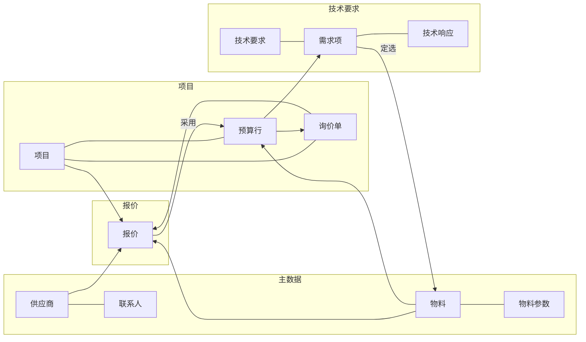
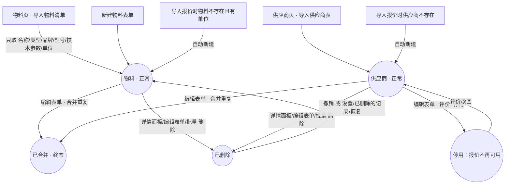
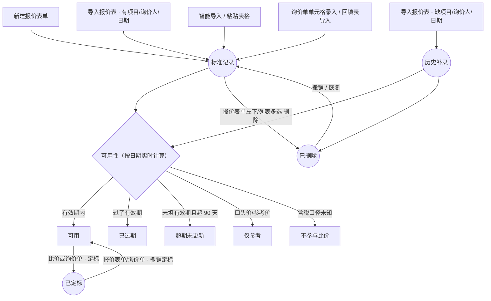
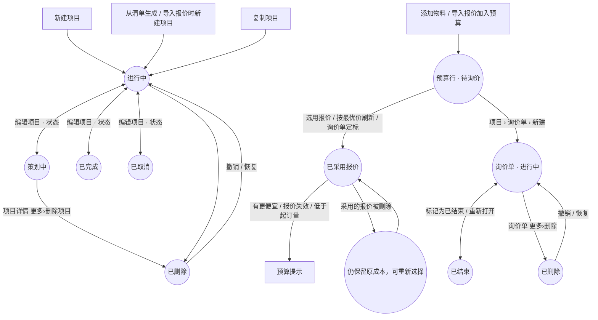
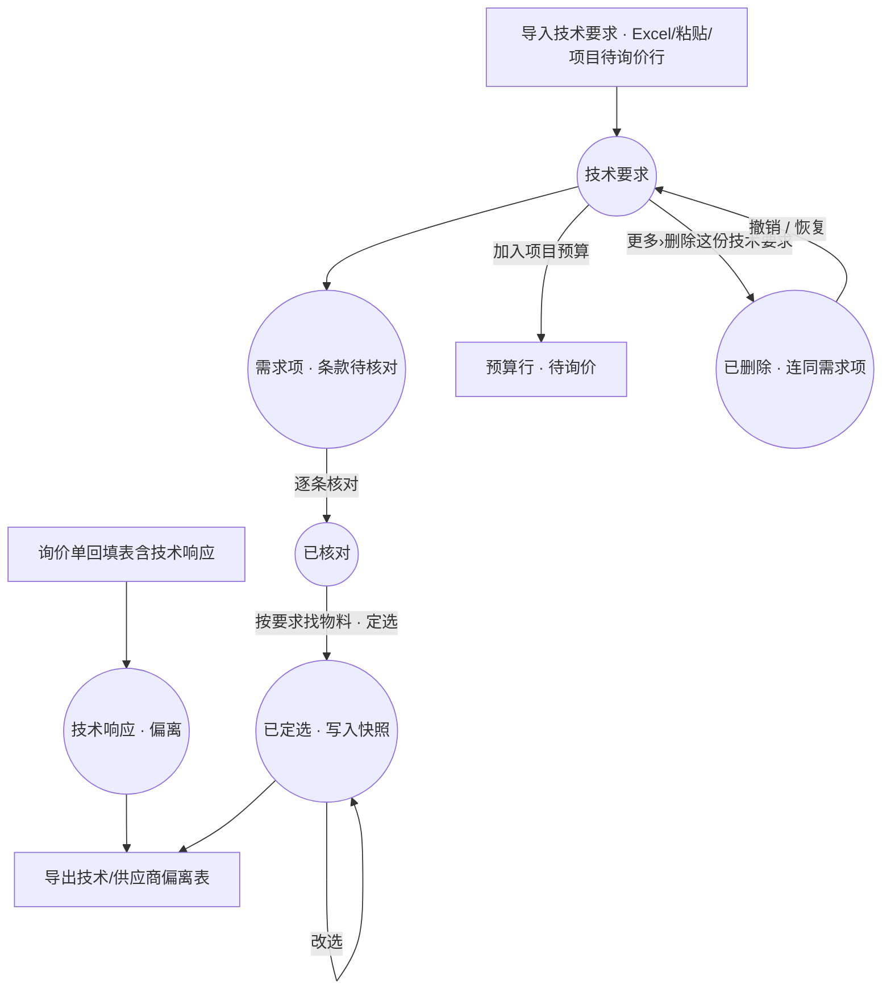
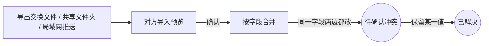

# 主线业务流程与状态可达性

> 2026-09-30。依据当前代码（`packages/supplier_core` 与 `apps/supplier_app`）逐条核对。
> 每个状态都列出**进入**与**离开**的操作入口；“✅ 已验证”表示有自动化测试覆盖该路径。

## 总览

## 主线一：物料与供应商（主数据）

| 状态 | 进入 | 离开 | 备注 |
|---|---|---|---|
| 物料/供应商·正常 | 新建表单；导入物料清单；导入供应商表；导入报价自动新建 ✅ | 删除、合并 | 导入物料不再顺带建供应商、联系人 ✅ |
| 供应商·推荐/慎用/停用 | 编辑表单“评价” | 同一处改回 | 停用供应商的报价不参与比价与预算 |
| 已合并 | 编辑表单的“疑似重复”→合并 | —（终态，引用已改指向） | 设计如此：合并不可撤销 |
| 已删除 | 详情面板“删除” ✅、编辑表单左下、列表多选批量删除 | 撤销提示条、已删除的记录→恢复 | 引用它的记录保留并标明“已删除” |

## 主线二：报价

| 状态 | 进入 | 离开 | 备注 |
|---|---|---|---|
| 标准记录 | 表单、导入、智能导入、询价单 ✅ | 删除 | 必须有项目、询价人、询价日期、报价日期 |
| 历史补录 | 导入报价表时缺项目、询价人或日期 ✅ | 删除 | **本次修复**：原来没有任何入口能产生（store 只允许“导入”产生，但导入都走标准记录） |
| 可用/过期/超期/参考/口径未知/未来日期/未填日期 | 由日期和字段实时计算 | 改日期、有效期、价格性质 | 不是存储状态，随时间自动变化 |
| 已定标 | 比价页、询价单“定标” | 报价表单、询价单“撤销定标” | 定标可写回预算行 |
| 已删除 | 报价表单“删除报价” ✅（**本次新增**，原来只能在列表多选删除）、列表批量删除 | 撤销、恢复 | 采用它的预算行仍可打开编辑 ✅ |

导入报价的“数量”列即起订量（`min_qty`）✅；同一数量在“同时加入预算”时也作为预算行数量。

## 主线三：项目、预算与询价

| 状态 | 进入 | 离开 | 备注 |
|---|---|---|---|
| 项目 4 种状态 | 新建默认“进行中”；项目表单下拉切换 | 同一处任意切换 | 项目列表默认只看“进行中”，其他状态在“全部” |
| 项目·已删除 | 项目详情“更多›删除项目” ✅（**本次新增可见入口**）、编辑表单 | 撤销、恢复 | 报价保留；按已删项目筛选的报价页不再崩溃 ✅ |
| 预算行·待询价/已采用 | 添加物料、导入、刷新、定标 | 编辑预算行 | 预算行点一下即编辑，编辑框左下删除 |
| 询价单·进行中/已结束 | 新建询价单；标题栏切换 | 同一处 | |
| 询价单·已删除 | 询价单页“更多›删除询价单” ✅（**本次新增**，原来无法删除） | 撤销、恢复 | 已收到的报价保留 |

## 主线四：技术要求选型

| 状态 | 进入 | 离开 | 备注 |
|---|---|---|---|
| 条款 未核对/已核对 | 导入时规则或 AI 识别；人工核对 | 改设备类别会重读未核对条款 | |
| 需求项 已定选 | 按要求找物料 → 定选 | 改选 | |
| 技术要求·已删除 | 页面“更多›删除” | 撤销、恢复 ✅ | **本次修复**：原来恢复只恢复技术要求本身，需求项留在已删除，页面显示“没有需求项” |

## 主线五：设备间数据交换

## 目前仍不可达或只读的状态

| 状态 | 说明 | 建议 |
|---|---|---|
| 报价 `inquiry_precision = instant`（精确到时刻的询价时间） | 数据校验支持，但界面只能选日期；只可能随其他设备的交换文件进来 | 保留兼容；如需要再在报价表单加时间选择 |
| 已合并 | 没有“取消合并” | 设计如此；误合并可从引用记录的变更记录追溯 |

## 本次同时修掉的界面问题（删除/编辑入口）

统一规则：
1. **有详情页的记录**，编辑和删除都在详情页可见：编辑是按钮或标题旁的笔形图标，删除在“更多”菜单最底部，红色，与其他操作用分隔线隔开。
2. **弹窗表单**里，删除固定在左下角（红色文字），远离右下角的“保存”。
3. **列表**支持多选批量删除，删除按钮为红色。
4. 所有删除都先确认（确认按钮为红色，写明会影响哪些引用），删除后提示条可“撤销”，并可在 设置 › 已删除的记录 中恢复。

| 位置 | 原来 | 现在 |
|---|---|---|
| 项目 | 删除藏在“编辑项目”弹窗里 | 详情页“更多›删除项目”；标题旁可直接编辑 |
| 报价 | 打开报价后无法删除，只能回列表多选 | 报价表单左下“删除报价” |
| 询价单 | 无法删除 | 询价单页“更多›删除询价单” |
| 物料/供应商详情面板 | 只有“编辑”，删除需进入编辑弹窗 | 面板直接有红色“删除” |
| 技术要求 | 确认按钮不是红色；无撤销；文案写“回收站” | 红色确认、可撤销、文案统一为“已删除的记录” |
| 项目详情 › 报价记录 | 行不可点 | 点击打开报价（可编辑/删除） |
| 已删除的记录 | 技术要求显示空标题 | 显示标题 |

## 附：数据中心能否自动更新

| 内容 | 来源 | 数据库/代码变化后 |
|---|---|---|
| 各类记录数量、数据质量检查 | 实时查询 `recordCounts()`、`dataQuality()`，监听每次写入 | 自动刷新 |
| 对象之间的引用（图的连线） | 由 `references`/`listReferences`（存储层的引用校验表）直接生成 | 自动跟随 |
| 字段列表、必填、枚举值 | `ontology.dart` 手写说明，测试逐项对照校验器 | 代码改了而说明没改 → 测试失败，不会悄悄过期 |
| 分组、图标、位置（展示） | 原来在 Flutter 和 G6 页面里各写死一份 | **本次**：分组改由 `objectGroups` 统一下发，未分组的新对象自动归入“其他”；Flutter 图给未摆放的新对象自动留位；测试保证每类对象都有分组 |
| 中文名称、字段含义 | 只能人写 | 由测试强制“每个字段都有说明”，缺了就失败 |

结论：结构和数据可以、并且现在已经是自动的；**含义**（中文名、说明）无法从代码推导，采用“缺了就让测试失败”的方式保证同步，而不是在运行时猜。
