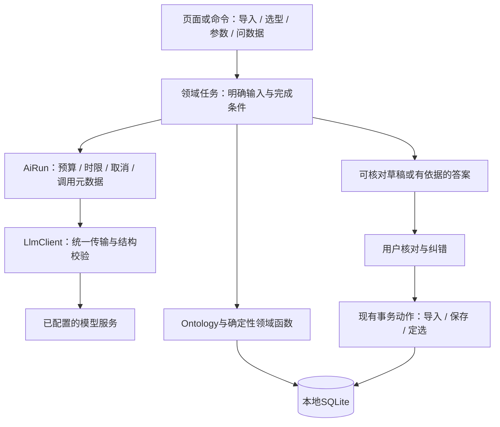

# AI native 全功能审查与改进

基线 `fc75c72`，独立分支 `codex/codex-agent`。本轮包含全部 LLM 入口和完整业务流程，不局限问答。用户指定 Muse=Meta Muse、Grokbot=x.ai/bot，排除 Marvis。

## 实施前约束与方案

目标：AI 把不规则材料转成可核对的业务草稿、帮助检索解释与选型；金额、约束判定、数据写入、交换恢复仍由确定性核心负责。一个底层执行核心，不等于所有任务必须使用同一长提示词或自主 Agent 循环。

备选：

1. 保持每个页面自行调模型：改动小，但预算、取消、格式错误和观测行为继续分裂，拒绝。
2. 本地共享轻量运行策略，领域任务各自编排：复用已有 Dart/SQLite 与 OpenAI-compatible transport，采用。
3. 迁移云端多 Agent/通用工作流平台：增加服务、存储、SDK和故障面，当前规模无证据证明收益，拒绝。

实施范围：

- 共享任务范围内的调用次数、时限、请求/响应大小、取消及元数据观测；取消关闭本地 HTTP 连接并阻止后续调用，不能承诺远端停止计费。
- 所有 LLM 能力使用同一运行层：问答、报价提取、清单结构化＋候选匹配、条款读取、参数提取。现有接口保持兼容。
- 结构化输出根结构错误明确失败/有限重试，不再误当空结果；超大单行与总输入有界。
- 页面停止/离开将取消任务；过期结果不能覆盖后来的编辑。AI 写入仍经原有预览与事务。
- 先补回归再实现；无网测试覆盖每条路径，已有在线授权范围内做小规模真实合成数据验证。

不新增依赖、数据库迁移、账号权限、云端调度或自治写入。本轮不将在线小样本分数包装为全功能可靠性认证。

## 审查方式

原生子代理启动后因账户用量限制全部失败，未产出本轮审查证据。后续由主代理直接检查源码、官方资料、反例和回归；不会声称完成了独立多代理评审。未启动 OMX CLI 共识运行时。

## 先把几个概念讲清楚

**模型**负责理解不规则语言，不能作为账本和技术判定的事实来源。**运行核心（harness）**负责让模型在可控范围内执行：给什么数据、能用什么工具、何时停止、失败怎么呈现。**工作流**是明确的步骤，例如“提取→查候选→核对→入库”；**Agent**是在运行中自行决定下一步工具的循环，例如问数据。不确定性只放在必要的步骤里。

**Ontology**是业务对象、关系、规则和动作的一致定义，不等于画关系图、向量库或把所有表描述塞进提示词。本项目已有对象字段、关联、预算和参数比较器，基础方向正确。AI native 的关键是把用户的目标变成可验证的业务产物：报价草稿、候选清单、偏离解释、待处理事项，而不是增加更多聊天入口。

## 全部 LLM 能力地图

| 能力 | 代码与真实执行方式 | 当前结论 |
|---|---|---|
| 智能报价/物料导入 | `material_import.dart` / `extractOffers`，分段提取；`planOffer` 去重与来源核对，`applyOffers` 事务写入 | 适合 AI；规范 Excel 应继续按列解析，不调用模型 |
| 按清单建项目 | `list_import.dart` / `proposeFromList`，结构化→本地检索最多8候选→每批15项模型匹配→本地选价→人工预览 | 不适合开放式自主 Agent；模型负责建议，选价与保存由代码负责 |
| 技术条款读取 | `spec_ai.dart` / `aiReadClauses`，仅处理未复核且规则未覆盖的条款，字典和原文约束核验 | 正确的“规则优先、AI补缺”，但证据里有数字不等于比较方向正确 |
| 产品参数提取 | `aiExtractParams`，复用条款读取返回未确认猜测；现有参数编辑主要仍为规则提取与人工确认 | 核心API已存在，并不是每个参数页面已经接入LLM；不能夸称全自动参数库 |
| 问数据 | `assistant.dart`，受限只读工具循环，`assistant_evidence.dart` 认证对象引用 | 适合 Agent；上一轮已证明主事实可正确，但附带叙述仍会越界 |

“智能选型”还有 `spec_match.dart` / `spec_compare.dart` / `spec_deviation.dart` 的确定性技术比较。它们不是 LLM，也不应被 LLM 替代。询价矩阵、预算、工作台预警、重复检测同样主要是业务规则。

## 不留情面的诊断

| 级别 | 问题及影响 | 处理 |
|---|---|---|
| P1 | 共用HTTP不等于共用运行核心：导入取消后仍继续后续批次，任务总量不受限 | 本轮共享任务预算、时限、取消；页面停止与离开都传到核心 |
| P1 | `offers/items` 类型错误被当作空列表，用户被告知“未识别”，实际是协议失败 | 本轮统一结构校验与一次有限重试；失败明确报错 |
| P1 | 单行超6000字符不会分段，长文总量、返回大小无上限 | 本轮有界分段、输入上限、调用/请求/响应预算 |
| P1 | 参数核验只确认数字、单位出现在原文，可能把“不小于2GB”变成“不大于2GB” | 已用反例复现；本轮拒绝与确定性解析方向矛盾的AI条件。不能据此声称所有语义方向问题已解决 |
| P1 | 条款编辑期间旧AI结果回来会覆盖更新；导入原文件被修改后仍可能保留错误原件作为证据 | 本轮核对条款内容快照，拒绝覆盖；导入按实际使用的文本/文件留证 |
| P2 | 模型“high”只是自评；命中候选ID只能证明候选存在，不能证明参数满足；检索前8项可能漏真解 | 本轮界面明确“建议≠技术符合”；排序质量、跨名称召回仍需专项数据集，不能给高置信度自动定选 |
| P2 | 项目生成预览里的报价和物料可能在确认前变化，现有方案未绑定整体预览版本 | 仍待独立动作级版本校验；后续要事务内核对版本，不靠再次问模型 |
| P2 | 跨分段的供应商标题/表头上下文会丢，模型可能漏行或重复；本轮分段有界不等于业务覆盖完整 | 后续加源行范围、输入/输出行对账、表头继承；不应直接加长prompt掩盖 |
| P2 | 上轮20题主事实正确但价格口径、最低范围、删除范围等附带叙述错误 | 需要领域结果声明价格基准/范围/时点，答案逐项对账；不能只调“聪明一点”的提示词 |
| P2 | 规则+AI条款66/69低于规则67/69；OPC DA/UA及2K等问题未必需要模型 | 优先修确定性别名和单位规则并校准标注；DP上下行不靠改golden刷分 |
| P2 | 单次模型返回缺少应有条目、重复索引、事实性负句等，不可能仅凭JSON schema判定正确 | 仍需任务级覆盖率与人工纠错记录；本轮没有用结构通过率冒充正确率 |

## 一套核心，保留不同的业务执行方式

代码统一在 `ai_runtime.dart` + `llm.dart`，不引入第二套模型SDK。`AiTask`区分五种任务，`AiRun`跨重试与分段共用预算；领域任务仍负责自己的工具、参数语义、证据和完成条件。问答已有工具轨迹，其他流程已有草稿原文；新增调用事件只含任务、次数、耗时与是否收到响应，不记录密钥、提示词或隐藏推理。

默认预算是24次模型调用、3分钟、单请求10万字符、单响应12.8万字符；对话仍保持最多8轮工具加1轮总结。提取输入最多6万字符、每段最多6000字符、最多200条待核对草稿。这是保守的可修改产品限制，不是模型上下文的token上限，也不是金额预算。

这是一套**本地运行核心**，尚不是持久工作队列：不承诺关机后继续、断电恢复、自动重试恢复或跨设备任务迁移。调用元数据接口也不是完整业务审计。没有证据证明这些复杂度现在值得引入。

## 从官方产品借什么

以下区分官方公开能力与本项目的设计推论；没有声称看过任何闭源内部实现。

| 参考 | 官方证据 | 本项目采用/建议 | 不照搬 |
|---|---|---|---|
| Codex | [agent loop](https://openai.com/index/unrolling-the-codex-agent-loop/) 描述模型、工具、上下文与终止；[App Server](https://openai.com/index/unlocking-the-codex-harness/) 将核心执行与多端界面分开 | 一个运行核心服务多个页面；明确完成/取消；结果可检查。借思想，不搬服务架构 | 代码沙箱、完整线程持久化、MCP/skills平台都不是当前导入任务的必需品 |
| Claude | [Building effective agents](https://www.anthropic.com/engineering/building-effective-agents) 区分固定工作流和自主Agent，并强调从简单可组合方案开始 | 导入和参数提取用固定流程，问数据才用动态工具循环；对关键中间结果做校验 | 每个按钮都配一个自主Agent，或用多Agent投票替代业务验证 |
| Meta Muse | [用户指定产品页](https://ai.meta.com/muse/)、[官方发布说明](https://about.fb.com/news/2026/09/introducing-muse-personal-ai-agent/) 描述长期目标、后台执行、用户控制及操作记录；发布说明链接其设计文档 | 借“目标→产物→审核”的交互；未来记住用户明确确认的字段映射和偏好，允许查看/删除 | 云VM、跨站账号托管、24小时自主行动；本机报价管理目前无需这些 |
| Grok Bot | [用户指定官网](https://x.ai/bot) 描述任务委派、示范工作流形成routine、多Bot和共享云计算机 | 借可复用的导入映射、询价步骤模板；让用户审阅已完成草稿，减少重复配置 | 多Bot协作、浏览器操控、自动对外发送和永久后台任务，成本与故障面不匹配当前产品 |
| Palantir | [对象层概念](https://www.palantir.com/docs/foundry/getting-started/introductory-concepts)、[事务动作](https://www.palantir.com/docs/foundry/object-edits/overview) | 同一对象语义供UI、AI、MCP使用；AI提案与事务动作分离；动作结果可核对 | 图数据库、全套企业权限/治理平台；SQLite并不妨碍实现核心语义 |

Muse和Grok Bot的官网不能证明它们在本项目的采购任务上优于现有方案。可借的是交互/执行边界，不是品牌光环。Claude文章是公开工程原则，部分工具例子随时间更新，本轮采用其中稳定的工作流划分。[Claude Code执行机制](https://code.claude.com/docs/en/how-claude-code-works)进一步描述了收集上下文、执行、验证的可中断循环，以及多个界面共用核心。本项目对应采用共享运行层和可取消任务，业务结果仍由确定性校验与人工核对把关。

## 整体功能中值得AI赋能的地方

优先级是本次设计判断，收益数字是**待验证门槛**，不是已取得的结果。

| 流程及现有基础 | AI适合做什么 | 确定性替代/边界 | 衡量与优先级 |
|---|---|---|---|
| 报价导入、`sheet_offers.dart` | 非规范文本提取、未知Excel表头映射草稿、同供应商多份材料合并建议 | 标准表头直接解析；逐行保留源位置；不臆算单价 | P0：单位报价录入+核对时间相对手工下降≥30%，数值字段零静默错误 |
| 清单建项目、`list_import.dart` | 需求拆解、检索同义词、解释候选差异 | 约束比较和有效单价由代码算；模型不能自动判合格 | P0：正确候选Recall@8与人工改选率，比较规则检索基线；没提升则不加模型 |
| 条款与参数、`spec_ai.dart` | 只补规则不理解的语句、提出待确认问题 | 型号别名、OPC共享前缀、单位换算应优先用规则 | P0：保留原有正确约束率100%，新增正确约束与核对时间；不能只看采纳数量 |
| 供应商/物料目录、`duplicates.dart` | 歧义重复项解释、合并影响摘要 | 唯一精确匹配与合并事务本地执行；禁止自主合并 | P1：建议误合并率为0，减少人工查证步骤 |
| 询价单与供应商回复、`inquiries.dart` / `supplier_responses.dart` | 生成缺项询问草稿、将回复映射到具体需求行 | 未回复状态、金额、供应商ID由确定性矩阵提供；发送仍由人执行 | P1：回复归位时间、行级匹配准确率、人工修改字数 |
| 项目预算、`budget.dart` | 解释预算差异、整理待询价清单、提出可比较的替代方案 | 总价/税/数量/失效/起订量全部本地算，不能让模型估造缺价 | P1：解释中每个金额有工具出处，错误价格口径为0 |
| 工作台、`workbench.dart` | 把现有预警整理成按项目的“今天需处理”摘要 | 到期/未回复/冲突判定已有SQL规则，无需再问模型 | P1：仅在用户需要摘要时调用，减少查找步骤；先做模板基线 |
| 技术偏离表、`spec_deviation.dart` | 将确定性比较结果写成清楚的偏离说明、列待澄清问题 | 不可将未知改写为满足，不可代用户确认文字条款 | P1：解释完整率、未知状态保留率、审阅时间 |
| 数据质量中心、`data_quality.dart` | 解释异常及修复建议，批量产生可审查修复草稿 | 异常发现仍用规则；修复要预览与事务校验 | P1：误修复为0、人工定位耗时；不做无人看管自动清洗 |
| 导出/报告、`project_export.dart` | 写项目摘要、价格比较说明、询价进展报告 | 表格数值、PDF布局和合计由现有代码生成 | P2：编辑时间；模板已够用就不调用模型 |
| 全局检索/问数据 | 当前页面上下文中的问题、跨对象只读导航、附引用的解释 | 不自动发送全部历史或业务库；明确搜索范围与分页 | P1：任务完成率、每问调用数、事实/引用错误率 |
| 备份、交换、LAN、恢复、加密、版本冲突 | 最多解释错误和差异供人看 | 核心过程完全确定性，禁用模型做自动合并/恢复判定 | 不做LLM执行；稳定性比“智能”更重要 |

最不值得做的是“AI算预算”“AI判报价过期”“AI自动修复交换冲突”“每页一个聊天框”和无人值守采购。它们不是提效所必需，反而削弱可复现性。

## 统一核心之后的产品路线

1. **先让现有能力可靠**：本轮运行治理与协议校验；补充语义不匹配数据集；修复规则能解决的参数缩写。P0不是更多按钮。
2. **建立可测的草稿闭环**：每项输出关联源段/单元格；显示新增/修改/未确认字段；收集用户明确确认的纠错，不偷偷上传历史。事务内重核版本，避免确认旧报价。
3. **串起一条采购任务**：导入需求→候选及缺证据→询价草稿→回复归位→确定性比价→预算说明。各步骤产物能返回原页面继续核对；失败只重跑失败步骤。先固定工作流，再评估哪里真的需要Agent规划。
4. **仅在收益被测量后增加新能力**：表头映射、回复归位、偏离解释优先；定时后台、向量索引、多模型路由、多Agent暂不建设。

建议为每个功能单独维护：规则基线、模型增量、字段/行召回、来源覆盖、静默错误、用户改动比例、耗时、调用数。在线回放和单元测试不能代替真实用户核对时间实验。一次模型调用成功也不是任务成功，用户确认更不是原始数据真实性的证明。

## 本轮落地与验证

已实现上面的共享运行核心、结构校验、输入分段限制、真正取消后续调用、条款过期结果保护、来源文件对应修复，以及AI条件不能颠倒规则比较方向。原有 `AssistantCancellation` 兼容名保留；新增取消参数均可选。没有把未来机会表包装成已交付功能。

验证证据：

- 先复现3个失败：错误 `offers`、错误 `items` 被当作空结果、超长单行越界；修复后通过。另复现“显存不小于2GB”被AI改成 `le` 的方向错误，修复后通过。
- 核心完整回归246项通过；最后补充观察器失败与取消器一致性后，目标12项通过。运行层覆盖取消后的晚响应、跨提取/匹配共享预算、重试预算、任务超时、输入/请求/响应限制和参数根结构错误。
- 页面专项已验证导入/匹配停止后不再调用下一段，也无数据写入；条款编辑后的旧AI结果不会覆盖修改；Excel直接读取仍保留正确原件。
- 应用完整回归96项通过，核心与应用静态分析均无问题，`git diff --check` 通过。
- [五类真实模型结果](../verification/2026-09-29-ai-workflows-live.json)：DeepSeek 5/5预设检查通过，7次模型调用；报价数值和来源字段、匹配已有泵并保留未匹配控制柜、条款 `ge 2GiB`、参数提取及带来源的目录计数均逐项核对。所有操作只返回草稿或答案，没有写业务数据。
- [69条条款复测](../verification/2026-09-29-ai-native-spec-live.json)：规则67/69，规则+AI66/69，静默错误0；AI采纳2、丢弃6。结果仍不能证明AI优于规则，DP标注、OPC DA/UA和2K问题保留在后续清单。

五类在线测试只覆盖每个入口的一个小样本，不是全领域正确率；没有采集真实用户效率数据、账单或token成本。跨请求持久恢复、预览版本绑定、字段级来源全覆盖、候选召回基准仍未完成。

运行：`packages/supplier_core/tool/ai_workflow_live_eval.dart`，通过环境变量 `DEEPSEEK_API_KEY` 提供密钥；不读取真实业务库，使用临时合成数据。新运行层无依赖增加、无schema变更，所有更改仅在独立工作区。
